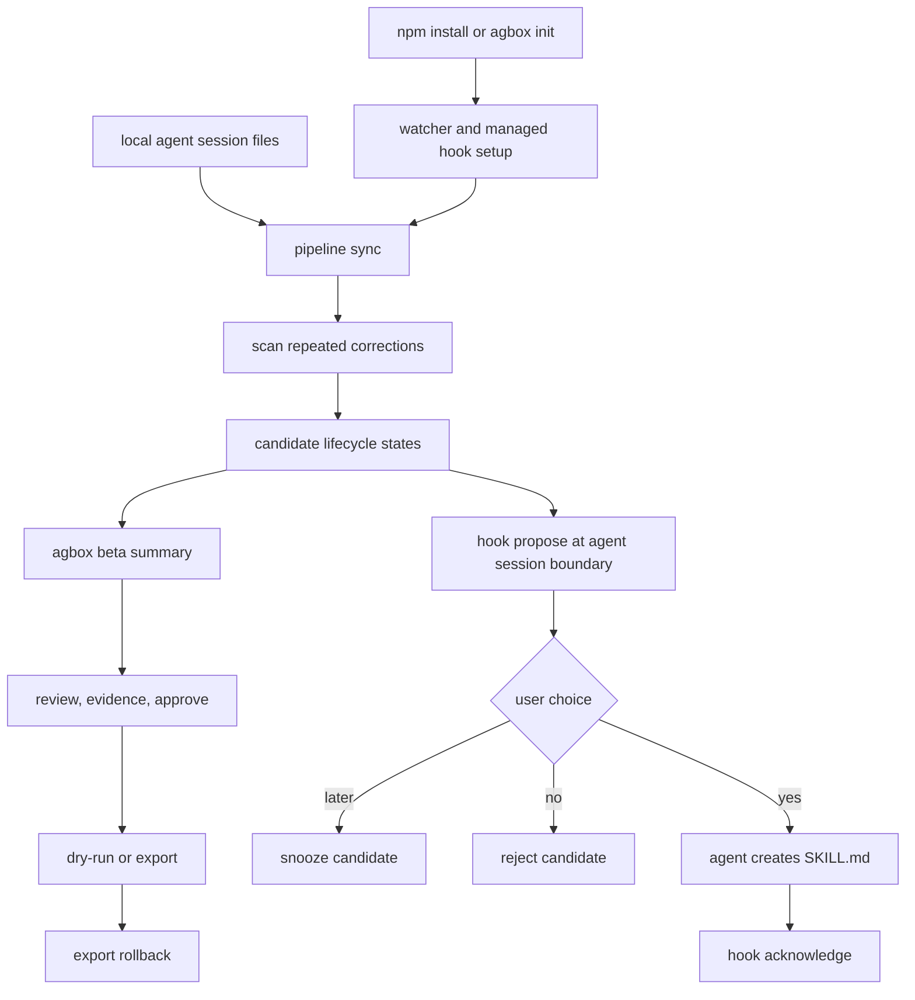

# feat: Make the beta aha loop obvious

## Summary

This plan turns the current agbox pieces into a beta-ready product loop: a user installs agbox, sees what it learned from local agent sessions, receives a clear in-agent skill proposal, and can apply or roll back the skill without trusting a black box.

The work stays inside the local-first CLI. It does not add cloud sync, team memory, or a new skill-generation engine.

---

## Problem Frame

agbox already has the hard parts in place: session ingestion, candidate scanning, evidence cards, reversible export, and hook-driven in-context proposals. The current beta experience still does not reliably create the "I should keep this installed" moment because those parts are exposed as separate commands and the most important proposal surface reads like an internal sidecar.

The current README also says "no hooks" while `init` installs proposal hooks for Claude, Codex, and Grok. That mismatch is a trust problem for beta users. The beta version needs to be clear about what agbox reads, what it writes, when it proposes, and how to undo every write.

---

## Assumptions

- The first beta target is a solo developer using macOS arm64, local CLI agents, and enough recent Claude/Codex/Cursor/Grok sessions for agbox to find repeated corrections.
- The product direction remains "local correction-to-skill compiler for AI coding agents", not a cloud team-memory product.
- The current session watcher plus in-context proposal architecture is kept. This plan tightens the loop rather than reverting to review-only.
- Landing page and growth-copy changes happen after the CLI behavior is accurate enough to screenshot.

---

## Requirements

**Beta aha loop**

- R1. A new beta-oriented command must show the best repeated correction candidates with causal evidence, current setup health, and the next safe action.
- R2. The beta summary must work in non-interactive terminals so it can be used in cold DM, email, README, and screen recording workflows.
- R3. Empty or first-run states must explain what agbox is waiting for without surfacing raw SQLite, watcher, or hook implementation errors.

**In-context proposal**

- R4. Hook proposals must read as a short user-facing recommendation the agent can relay, not as an internal implementation artifact.
- R5. Proposal handling must preserve explicit user control: yes creates a skill, no rejects with cooldown, later snoozes, and silence does not keep nagging.
- R6. Proposal lifecycle states must be visible through CLI and TUI filters so `proposal_ready`, `proposed`, `accepted`, and `snoozed` candidates do not disappear from user review.

**Trust and reversibility**

- R7. Install and status output must disclose both watcher setup and managed proposal hooks, including how to disable or remove them.
- R8. Skill export paths must keep dry-run, marker wrapping, backup, manifest, and rollback behavior visible in the beta path.
- R9. Documentation must match the shipped behavior before beta outreach starts.

**Verification**

- R10. The implementation must include CLI, proposal, TUI, export, and install-path tests for the beta loop.
- R11. Manual verification must cover a temporary store demo, a fixture-backed proposal, and a no-session first-run path.

---

## High-Level Technical Design

The current architecture stays local. The new work makes the product loop explicit across two entry points: `agbox beta` for a human-readable terminal summary and `agbox hook propose` for timely in-agent proposal.

---

## Key Technical Decisions

- KTD1. Add `agbox beta` instead of making `review` carry the first-run story: `review` is interactive and already has a TUI job, while beta outreach needs a terminal-safe summary that can be copied, screenshotted, or pasted into a DM.
- KTD2. Keep in-agent proposals but rewrite the payload around consent: the hook path is the only current surface that can create surprise and delight during normal work, but it must be short, contextual, and easy to dismiss.
- KTD3. Treat proposal lifecycle states as first-class CLI state filters: hiding `proposal_ready` and `proposed` behind pending-only defaults makes the system look empty exactly when the in-context loop is active.
- KTD4. Keep export separate from proposal acceptance: a user saying yes to a skill proposal allows the agent to create a native `SKILL.md`; writing shared project files such as `AGENTS.md` or `CLAUDE.md` remains an explicit export step with rollback.
- KTD5. Avoid new persistence or backend surfaces: all work builds on the existing SQLite store, session adapters, and export manifest because beta risk is product clarity, not infrastructure scale.
- KTD6. Update public copy only after CLI truth is settled: README and landing copy should not lead with "no hooks" if the shipped beta installs managed proposal hooks.

---

## Implementation Units

### U1. Add the beta summary command

- **Goal:** Add a non-interactive `agbox beta` command that runs sync/scan, prints setup health, shows the top candidates with causal evidence, and gives one safe next action per candidate.
- **Requirements:** R1, R2, R3, R8, R10
- **Dependencies:** None
- **Files:** `internal/cli/beta.go`, `internal/cli/cli.go`, `internal/cli/cli_test.go`, `internal/evidence/evidence.go`
- **Approach:** Reuse `pipeline.SyncAll`, `store.ListCandidatesByState`, and `evidence.Build`. Show candidates in this priority order: `proposal_ready`, `proposed`, `pending`, then `approved`. Include evidence as `agent action -> user correction`, confidence, repeats, and a safe command such as `agbox evidence <id>` or `agbox export <id> --dry-run`.
- **Execution note:** Start with CLI tests because the copy and state routing define the feature.
- **Patterns to follow:** `runDiscover` in `internal/cli/cli.go` for non-interactive candidate cards; `runDemo` for temporary-store proof; `evidence.Build` for causal occurrence display.
- **Test scenarios:**
  - With an empty temp store, `agbox beta` prints no scary DB error, shows watcher/source status, and points to `agbox demo` or normal agent use.
  - With two repeated fixture corrections, `agbox beta` shows one candidate, repeats, confidence, and a causal `npm install -> use bun` style example.
  - With a `proposal_ready` candidate, `agbox beta` explains that agbox is ready to propose it inside the agent and shows manual review commands.
  - With an approved candidate, `agbox beta` prefers a dry-run export command over direct write.
  - With `--limit 0` or negative limits if supported, behavior is validated as either a documented no-op or a clear validation error.
- **Verification:** A user can run one command after install and understand whether agbox has learned anything, what it saw, and the safest next action.

### U2. Fix first-run and empty-state health

- **Goal:** Make `status`, `doctor`, `discover`, `review`, and `beta` behave cleanly before a user has run enough sessions or before watcher/hook setup is complete.
- **Requirements:** R3, R7, R10, R11
- **Dependencies:** U1 for shared beta empty-state copy if the helper is introduced there
- **Files:** `internal/cli/status.go`, `internal/doctor/doctor.go`, `internal/cli/cli.go`, `internal/cli/cli_test.go`, `internal/doctor/doctor_test.go`
- **Approach:** Introduce a small shared health summary shape for store path, watcher state, last sync, source count, hook state, corrections, and candidates. Convert low-level open or count failures into setup guidance only where a user-facing command can recover from them.
- **Patterns to follow:** `doctor.Run` for health lines; `watcher.Status` and `connect.StatusAll` for setup state.
- **Test scenarios:**
  - `agbox status` in a fresh temp home prints store path, watcher state, last sync as never, and zero counts.
  - `agbox doctor` in a fresh temp home distinguishes "not installed" from "broken" and includes repair guidance.
  - `agbox discover` with zero scanned corrections keeps the current next-step guidance and does not mention manual `capture` as the primary beta path.
  - A simulated store open failure returns one friendly setup error without losing the original cause for debugging.
- **Verification:** The first command a beta user runs never looks like a crash when the real issue is "no data yet".

### U3. Expose proposal lifecycle states across CLI and TUI

- **Goal:** Make proposal states reviewable and filterable in the same places as pending, approved, rejected, and exported candidates.
- **Requirements:** R6, R10
- **Dependencies:** None
- **Files:** `internal/cli/cli.go`, `internal/tui/review.go`, `internal/tui/review_test.go`, `internal/cli/cli_test.go`, `internal/model/model.go`
- **Approach:** Extend `validReviewState`, command help, `stateBadge`, and review data loading to accept all existing `model.CandidateState` values. Keep default `review` focused on pending unless product testing shows proposal states should become default.
- **Patterns to follow:** Existing `validReviewState`, `displayState`, and `stateBadge` switch patterns.
- **Test scenarios:**
  - `agbox review --state proposal_ready --help` documents the state without opening the store.
  - Non-interactive `review --state proposed` validates the state before returning the terminal requirement.
  - TUI render shows distinct labels for `proposal_ready`, `proposed`, `accepted`, and `snoozed`.
  - `discover --state all` includes proposal states in sort order without duplicate cards.
- **Verification:** A candidate suggested by the hook loop can always be found again from CLI or TUI.

### U4. Rewrite the in-context proposal payload

- **Goal:** Replace the current sidecar-style injection with a concise agent instruction that produces a clear user-facing proposal and handles yes/no/later consistently.
- **Requirements:** R4, R5, R10, R11
- **Dependencies:** U3 for lifecycle visibility
- **Files:** `internal/propose/injection.go`, `internal/propose/propose.go`, `internal/propose/acknowledge.go`, `internal/propose/propose_test.go`, `internal/cli/hook.go`, `internal/cli/cli_test.go`
- **Approach:** Keep the hidden candidate markers required for acknowledgement, but change the payload structure around the agent's job: summarize the repeated correction, show one causal example, ask one yes/no/later question, and run the appropriate `accept`, `reject`, or `snooze` command after the user's answer. Remove copy that makes the payload look like a user-visible document.
- **Patterns to follow:** Existing candidate ID markers in `RenderInjection`; `Acknowledge`, `Reject`, and `Snooze` state transitions in `internal/propose/acknowledge.go`.
- **Test scenarios:**
  - Rendered payload contains candidate markers and skill frontmatter requirements needed for acknowledge.
  - Rendered payload contains a short user-facing proposal instruction with evidence, a yes/no/later choice, and no "sidecar" heading.
  - `hook propose` emits nothing when no project-matching candidate is ready.
  - `hook propose` marks a delivered candidate as `proposed` only after stdout write succeeds.
  - `hook acknowledge` moves a proposed candidate to `accepted` when a native skill file includes `agbox_candidate_id`.
- **Verification:** During normal agent use, the user sees a specific proposal like "You corrected this 5 times; should I create a skill?" rather than internal instructions.

### U5. Make install, hook trust, and rollback explicit

- **Goal:** Ensure installation tells users exactly what agbox installed, how to verify it, and how to remove managed hooks or undo project writes.
- **Requirements:** R7, R8, R9, R10
- **Dependencies:** U1, U3, U4
- **Files:** `internal/cli/init.go`, `internal/cli/connect.go`, `internal/connect/connect.go`, `internal/doctor/doctor.go`, `npm/cli/scripts/postinstall.js`, `internal/cli/cli_test.go`, `internal/connect/connect_test.go`
- **Approach:** Add one global hook opt-out path for install flows, document the existing per-agent skip env vars, and update init/postinstall output to say "watcher and managed proposal hooks" when hooks are installed. Include `agbox disconnect <agent>` guidance in status or doctor output when hooks are connected.
- **Patterns to follow:** Existing `AGBOX_SKIP_CONNECT_*` handling in `connectAllAgents`; `connect.BuildPlan` backup and marker handling.
- **Test scenarios:**
  - `agbox init` output names watcher setup, managed hook setup, verification commands, and disconnect commands.
  - `agbox init --quiet` remains quiet except for unavoidable trust notes from external agents.
  - A new all-hooks opt-out prevents `connectAllAgents` from applying managed hook configs.
  - `postinstall.js` prints accurate installed or skipped wording for watcher and hooks.
  - `doctor` shows connected hooks with enough detail to remove them.
- **Verification:** A beta user can tell what agbox changed on their machine and can undo managed hook changes without reading source.

### U6. Keep reversible export prominent in review and beta flows

- **Goal:** Make the safe write path visible wherever agbox asks the user to promote a workflow.
- **Requirements:** R8, R10, R11
- **Dependencies:** U1, U3
- **Files:** `internal/tui/review.go`, `internal/tui/review_test.go`, `internal/cli/cli.go`, `internal/export/export.go`, `internal/export/export_test.go`
- **Approach:** Preserve the existing dry-run and rollback mechanics, but surface the generated export ID and rollback command after TUI export and beta summary recommendations. Avoid automatically exporting from hook acceptance.
- **Patterns to follow:** `export.Apply`, `export.Rollback`, and marker-based `mergeContent` in `internal/export/export.go`.
- **Test scenarios:**
  - TUI export success message includes the path, target, export ID, and rollback command.
  - CLI dry-run still does not write files or create an export record.
  - Apply writes marker-wrapped content and records backup metadata.
  - Rollback restores the previous file and returns the candidate to approved state.
- **Verification:** Any project file write agbox suggests has a visible undo path.

### U7. Update docs after behavior lands

- **Goal:** Align README, package copy, and internal design notes with the beta behavior that actually ships.
- **Requirements:** R9
- **Dependencies:** U1, U4, U5, U6
- **Files:** `README.md`, `npm/cli/package.json`, `docs/superpowers/specs/2026-06-22-session-watcher-design.md`, `docs/superpowers/plans/2026-06-22-session-watcher.md`
- **Approach:** Replace "no hooks" claims with precise language: watcher reads session files; managed hooks only inject skill proposals and acknowledge created skills; project file writes happen through explicit export. Update the quick start to make `agbox beta` the first command after install.
- **Patterns to follow:** Existing README structure around "30-second aha", "Quick start", and "Privacy & local-first".
- **Test scenarios:** Test expectation: none for prose-only docs, but every command shown in README should match CLI help and shipped behavior.
- **Verification:** A beta user who reads the README sees the same behavior they get after install.

---

## Scope Boundaries

### In Scope

- Local CLI improvements for beta onboarding, candidate review, proposal lifecycle, managed hook transparency, and reversible export visibility.
- Tests that validate the CLI surfaces and state transitions behind the beta loop.
- README/package copy updates that match the shipped local behavior.

### Deferred to Follow-Up Work

- `agbox-landing-page` copy and visual updates. The landing page should use screenshots or terminal captures from the finished CLI.
- A real beta feedback collector or telemetry backend. For now, `agbox beta` should produce copyable local output.
- Hem-style setup snapshots beyond the existing export backup, manifest, repair, and rollback path.
- Windows/Linux watcher support.

### Outside This Product's Identity

- Cloud team memory, shared company brain, or cross-user sync.
- Automatic silent skill export without explicit user approval.
- Storing full raw agent transcripts in SQLite.

---

## System-Wide Impact

- **CLI contract:** `agbox beta` becomes a new top-level command and proposal states become documented CLI filter values.
- **Agent surfaces:** Hook payload wording changes what Claude, Codex, and Grok see at session boundaries, so tests need to protect candidate markers and acknowledgement behavior.
- **Local trust boundary:** Install and postinstall copy must disclose managed config writes because hooks modify agent config files outside the project.
- **Persistent state:** Candidate state transitions already exist; this work exposes and tests them rather than adding a new state machine.
- **Documentation:** README claims must match watcher plus hook reality before outreach.

---

## Risks & Dependencies

- **False-positive proposals:** Low-quality candidates could annoy users. Mitigate with existing thresholds, project matching, cooldowns, and a beta summary that frames low-confidence findings as reviewable rather than ready.
- **Install surprise:** Auto-installed hooks can feel invasive. Mitigate with explicit install wording, opt-out, status visibility, and disconnect guidance.
- **State fragmentation:** Pending, proposal-ready, proposed, accepted, approved, and exported can confuse users. Mitigate with a small state glossary in help/docs and state-specific next actions.
- **Docs drifting from behavior:** README currently conflicts with hook behavior. Mitigate by making docs the last unit after CLI output is stable.
- **Sandboxed or nonstandard agent installs:** Source discovery and hook config paths may be absent. Mitigate with first-run health output that treats absence as setup state, not product failure.

---

## Acceptance Examples

- AE1. Fresh install with no sessions: `agbox beta` reports watcher/hook/source state, says no repeated corrections yet, and offers `agbox demo` without any database-looking error.
- AE2. Repeated package-manager correction: `agbox beta` shows the candidate, repeats, confidence, and a causal example where the agent ran npm and the user corrected it to bun.
- AE3. In-agent proposal: at a session boundary, agbox injects one ready candidate and the agent asks whether to create a skill; yes creates a native skill and acknowledgement moves the candidate to `accepted`.
- AE4. Dismissed proposal: no rejects the candidate for the cooldown period; later snoozes it for 24 hours; neither path repeats the prompt immediately.
- AE5. Review visibility: `agbox review --state proposed` and `agbox discover --state all` both make a proposed candidate visible with evidence.
- AE6. Safe export: approved candidates still require an explicit export, and the success output includes a rollback command.

---

## Documentation / Operational Notes

- Update README after the CLI output is final enough to quote exactly.
- Keep `agbox demo` as the safe proof path for users who do not yet have enough local session history.
- Keep raw transcript privacy language precise: session files remain on disk, and agbox persists redacted excerpts, hashes, and metadata by default.
- For beta outreach, use `agbox beta` output as the artifact to request feedback on.

---

## Sources / Research

- `docs/superpowers/specs/2026-06-22-session-watcher-design.md` established the session watcher, causal evidence, local store, and review-first direction.
- `docs/superpowers/plans/2026-06-22-session-watcher.md` mapped the initial session ingestion implementation.
- `internal/cli/cli.go` contains the current command surface, including `discover`, `review`, `demo`, `hook`, `export`, and state validation gaps.
- `internal/propose/injection.go`, `internal/propose/propose.go`, and `internal/propose/acknowledge.go` contain the current in-context proposal loop.
- `internal/propose/state/state.go` defines the candidate lifecycle and cooldown behavior.
- `internal/tui/review.go` contains the current review TUI and export target picker.
- `internal/export/export.go` contains dry-run planning, marker wrapping, backup creation, and rollback behavior.
- `internal/cli/init.go`, `internal/cli/connect.go`, `internal/connect/connect.go`, and `npm/cli/scripts/postinstall.js` define watcher and managed hook installation behavior.
- `README.md` currently documents the beta promise but conflicts with the managed hook behavior.
