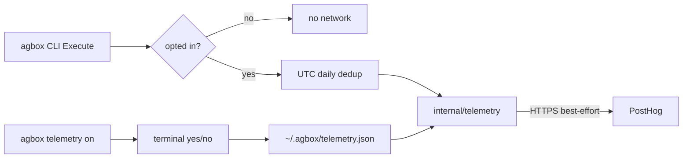

# feat: Opt-in DAU-only telemetry

## Summary

Add **opt-in, anonymous usage telemetry** to agbox so maintainers can see **total opted-in users**, **unique DAU/WAU/MAU**, and **usage streaks** in PostHog without sending prompts, sessions, paths, or machine fingerprints. v1 emits `install_completed` once and `agbox_daily_active` at most once per UTC day (with `streak_days`). Each opt-in gets a **random UUID** as anonymous `distinct_id`. Telemetry is off by default; network transmission requires `agbox telemetry on` with terminal confirmation.

---

## Problem Frame

agbox has no network telemetry today. The beta plan deferred a feedback collector. Founders cannot observe DAU/WAU/MAU without npm proxies or voluntary `agbox beta` DM output. A brainstorm and multi-agent review converged on the narrowest useful signal: **daily active installs**, with explicit opt-in to preserve local-first trust.

---

## Assumptions

- Maintainer provisions a PostHog project (US host default: `https://us.i.posthog.com`) with a capture-only API key embedded at build time via `-ldflags`.
- Opt-in participation may be low; unique DAU counts represent **opted-in installations**, not total npm installs (per requirements A2).
- npm `postinstall` runs `agbox init --quiet` with piped stdio — no interactive opt-in prompt there.
- LazyCodex/OmO `telemetry-core` patterns inform design but agbox implements a small Go-native package (no Bun/Node dependency in the CLI binary).

---

## Requirements Traceability

| Req | Plan coverage |
|-----|----------------|
| R1 default off | U1, U2 |
| R2 explicit opt-in | U2 |
| R3 opt-out no-op | U1, U2 |
| R4 two events only | U1, U3 |
| R5 payload allowlist | U1, U6 |
| R6 best-effort + HTTPS | U1, U3 |
| R7 PostHog, no person profiles | U1, U7 |
| R12 streak_days | U1 |
| R8 README privacy | U5 |
| R9 doctor/status | U4 |
| R10 no silent postinstall send | U5 |
| R11 no funnel/command events | U1 (enforced by event registry) |

**Resolved from Outstanding Questions (planning):**

- **O1:** `install_completed` fires **once per machine** on first successful opt-in confirmation, not on every `init` or npm postinstall.
- **O2:** Opt-in is offered **only** via `agbox telemetry on`. `init` and postinstall print that telemetry is off by default; they do not prompt or send.
- **O3:** Official `-notelemetry` build is **fast-follow** (document in scope boundaries; not a v1 ship gate).

---

## High-Level Technical Design

**State file** (`~/.agbox/telemetry.json`, approximate shape):

- `enabled: bool`
- `anonymous_id: string` (random UUID generated at opt-in; PostHog `distinct_id`)
- `install_completed_sent: bool`
- `last_active_day_utc: string` (YYYY-MM-DD)
- `current_streak_days: int` (consecutive active UTC days including today)

`anonymous_id` is random, not derived from hostname or hardware. Streak is computed locally: if last active was yesterday UTC, increment; else reset to 1.

---

## Key Technical Decisions

- KTD1. **Random UUID at opt-in, not machine fingerprint.** `anonymous_id` is `crypto/rand` UUID generated on `agbox telemetry on` confirmation. Never derived from hostname, serial, username, or MAC. Enables unique DAU without identifying the machine or person.
- KTD2. **PostHog `distinct_id` = `anonymous_id`** with `$process_person_profile: false` and no `$identify` / `$set`. Maintainer sees total opted-in users (`install_completed` count), unique DAU/WAU/MAU, and streak histogram from `streak_days`.
- KTD2b. **Streak algorithm:** on each new UTC active day, if `last_active_day_utc` == yesterday → `current_streak_days++`; else → `current_streak_days = 1`. Attach `streak_days` to `agbox_daily_active` payload.
- KTD3. **`agbox_daily_active` fires on first foreground `Execute` per UTC day** after opt-in (excluding `telemetry` subcommands themselves). Watcher-only background use is not a v1 trigger — document undercount risk in README.
- KTD4. **Typed payload struct + JSON marshal test** — `install_completed`: `agbox_version`, `os_family`, `arch`, `anonymous_id`. `agbox_daily_active`: same plus `streak_days` (int).
- KTD5. **Env `AGBOX_TELEMETRY=0` forces off**; no env value forces on without persisted opt-in — prevents silent corporate enablement.
- KTD6. **Telemetry hooks run async after command returns** (goroutine + short timeout) so R6 hot-path guarantee holds.

---

## Implementation Units

### U1. Core telemetry package

- **Goal:** Isolated `internal/telemetry` with opt-in gate, dedup, HTTPS PostHog client, and allowlisted payloads.
- **Requirements:** R1, R3, R4, R5, R6, R7
- **Dependencies:** None
- **Files:** `internal/telemetry/telemetry.go`, `internal/telemetry/posthog.go`, `internal/telemetry/state.go`, `internal/telemetry/payload.go`, `internal/telemetry/telemetry_test.go`
- **Approach:** `Enabled()` reads state file; `RecordDailyActive` updates streak, dedups per UTC day, sends `streak_days`; `RecordInstallCompleted` fires once on opt-in. Payloads as KTD4. PostHog `distinct_id` = `anonymous_id`. Use `net/http` with TLS, 5s timeout, swallow errors.
- **Patterns to follow:** `internal/privacy` redaction discipline; `internal/pipeline` best-effort semantics; LazyCodex `docs/reference/codex-telemetry.md` for PostHog property shape.
- **Test scenarios:**
  - Default state: `Enabled()` false, no HTTP calls (inject transport mock).
  - Opt-in state: first `RecordDailyActive` sends once per UTC day with correct `streak_days`; second same-day call no-ops.
  - Streak: active yesterday → streak increments; skip one UTC day → streak resets to 1.
  - `install_completed` sends once when flag unset; second call no-ops.
  - `AGBOX_TELEMETRY=0` overrides persisted enabled.
  - Serialized payload JSON contains only allowlisted keys.
  - PostHog body includes `$process_person_profile: false`.
- **Verification:** Package tests pass with mocked HTTP; no import from telemetry into session/ingest packages.

### U2. Telemetry CLI commands

- **Goal:** `agbox telemetry on|off|status` with disclosure and confirmation.
- **Requirements:** R2, R3, R9
- **Dependencies:** U1
- **Files:** `internal/cli/telemetry.go`, `internal/cli/cli.go`, `internal/cli/cli_test.go`
- **Approach:** `on` prints: events list, PostHog as recipient, retention note (maintainer-configured), opt-out commands; requires `yes` on stdin. `off` clears enabled flag. `status` prints enabled/disabled and how to change. Wire subcommands in `Execute` switch before daily_active hook.
- **Test scenarios:**
  - `telemetry status` when disabled prints off + hint for `telemetry on`.
  - `telemetry on` with non-yes input does not enable or send.
  - `telemetry on` with yes generates random `anonymous_id`, enables state, sends `install_completed` once.
  - `telemetry off` disables; subsequent `Execute` sends nothing.
- **Verification:** Help text documents subcommands; tests use `strings.NewReader("yes\n")`.

### U3. Daily active hook in CLI entry

- **Goal:** After successful command execution, record daily active for opted-in users.
- **Requirements:** R4, R6
- **Dependencies:** U1, U2
- **Files:** `internal/cli/cli.go`
- **Approach:** Thin wrapper: after main switch returns nil, call `telemetry.MaybeRecordDailyActive()` unless command is `telemetry`, `help`, or version-only. Run in goroutine; never propagate errors to exit code.
- **Test scenarios:**
  - Opted-in `agbox status` triggers one mock capture per UTC day.
  - Opted-out `agbox status` triggers zero captures.
  - Failed subcommand still may record daily active (user ran CLI) — document behavior.
- **Verification:** Integration test with temp home and mock transport.

### U4. Doctor and status surfacing

- **Goal:** Setup health shows telemetry state.
- **Requirements:** R9
- **Dependencies:** U1
- **Files:** `internal/doctor/doctor.go`, `internal/doctor/doctor_test.go`, `internal/cli/status.go` (optional one-liner)
- **Approach:** Add `telemetry: off (opt-in via agbox telemetry on)` or `telemetry: on` line to doctor report.
- **Test scenarios:** Doctor output includes telemetry line in both states.
- **Verification:** `agbox doctor` output stable for copy/paste in support.

### U5. Install, postinstall, and README trust copy

- **Goal:** No silent transmission; privacy section matches behavior.
- **Requirements:** R8, R10
- **Dependencies:** U2
- **Files:** `README.md`, `npm/cli/scripts/postinstall.js`, `internal/cli/init.go`
- **Approach:** Rewrite Privacy section: sessions/prompts stay local; optional anonymous usage stats (user count, DAU, streak) require `agbox telemetry on` and use a random ID (not hostname-derived). Opt-in copy lists `streak_days`. Remove or narrow "Everything stays local" to "Core workflow data stays local." Postinstall adds one line: `telemetry: off by default`. No network calls from init/postinstall.
- **Test scenarios:**
  - `cli_test` asserts init output mentions telemetry off when verbose.
  - README contains opt-in instructions and PostHog disclosure.
- **Verification:** Manual read of Privacy section shows no contradiction with opt-in telemetry.

### U7. PostHog dashboard views (maintainer)

- **Goal:** Document dashboard setup so founders can read user count, DAU, and streaks.
- **Requirements:** R7, R12
- **Dependencies:** U1
- **Files:** `docs/telemetry-dashboard.md` (maintainer-only, or README maintainer section)
- **Approach:** Configure PostHog insights:
  - **Total opted-in users:** unique `distinct_id` on `agbox_install_completed` (all time)
  - **DAU / WAU / MAU:** unique `distinct_id` on `agbox_daily_active` per period
  - **Streak distribution:** histogram or breakdown of `streak_days` on latest daily event per user; filter `streak_days >= 7` for power users
  - **Retention:** built-in retention on `agbox_daily_active` (optional)
- **Verification:** Maintainer can answer “how many users opted in?” and “how many used it 7 days in a row?” from dashboard without SQL.

### U6. Build metadata and regression guards

- **Goal:** Version in events; CI proves privacy constraints.
- **Requirements:** R5, R6
- **Dependencies:** U1
- **Files:** `cmd/agbox/main.go` or `internal/telemetry/version.go`, `.github/workflows/` (if CI exists), `internal/telemetry/payload_test.go`
- **Approach:** Inject `version` via `-ldflags` at release build (match npm publish workflow). Test fails if payload struct gains fields without test update.
- **Test scenarios:** Payload test enumerates expected JSON keys; version non-empty in test build tag.
- **Verification:** Published binary sends real version string in events.

---

## Sequencing

1. **U1** — package + tests (foundation)
2. **U2** — CLI opt-in/out (enables manual testing)
3. **U3** — daily active hook
4. **U4** — doctor line
5. **U5** — README + postinstall copy
6. **U6** — version ldflags + CI payload guard
7. **U7** — PostHog dashboard doc (can run in parallel with U5)

U2 and U4 can parallelize after U1. U5 should land before any public release tag.

---

## Scope Boundaries

### In scope

- All units U1–U7 above

### Deferred

- Aha funnel events, per-command tracking, crash reporting, north-star aggregates
- Default opt-out telemetry
- Self-hosted endpoint
- `-notelemetry` official build artifact
- Watcher background daily_active trigger
- PostHog data deletion automation on opt-out (document manual maintainer procedure in README)

### Outside product identity

- Uploading prompts, sessions, paths, or skill content (unchanged)

---

## Risks and Dependencies

| Risk | Mitigation |
|------|------------|
| Low opt-in rate | Accept opted-in cohort DAU; keep `agbox beta` DM path; revisit funnel in v2 only if cohort justifies |
| Anonymous ID confusion | README explains random UUID vs hostname hash; opt-in copy names what is sent |
| PostHog key in binary | Capture-only key; rotate on leak; document in README |
| Watcher-only users undercounted | Document in README; v2 may add watcher tick with shared dedup |
| Trust backlash | Opt-in default, full Privacy rewrite, doctor transparency |

**External:** PostHog project + API key (maintainer). **Code:** first `net/http` usage in agbox (A3).

---

## Verification Checklist (manual)

- [ ] Fresh install: `tcpdump`/Little Snitch shows **no** agbox telemetry traffic
- [ ] `agbox telemetry on` + yes: one PostHog request; `install_completed` in dashboard
- [ ] Second CLI command same day: no second daily event
- [ ] Next UTC day: one new `agbox_daily_active` with `streak_days: 2`
- [ ] Skip one UTC day: next active day shows `streak_days: 1`
- [ ] `agbox telemetry off`: no further traffic
- [ ] `AGBOX_TELEMETRY=0`: overrides on state
- [ ] README Privacy section matches behavior

---

## Success Criteria (from requirements)

- S1: Maintainer sees total opted-in user count, DAU/WAU/MAU, and streak distribution (3+/7+/30+ day buckets) within one week of beta outreach
- S2: Non-opted-in user can verify no transmission via docs + doctor + network observation
- S3: README/install copy consistent with opt-in DAU-only behavior
- S4: Replace subjective GitHub issue criterion with: zero P0 telemetry-trust issues in 30 days post-ship