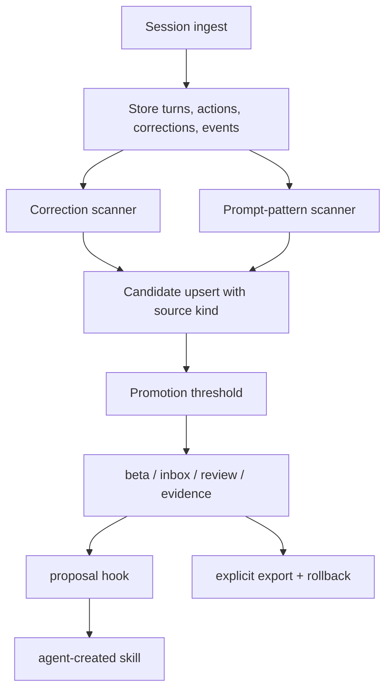

# fix: Detect repeated prompt patterns

## Summary

agbox currently learns repeated corrections better than repeated prompts. This plan makes repeated user prompts a first-class candidate source, keeps correction learning intact, and hardens session ingestion so oversized JSONL lines do not stop the watcher from discovering new patterns.

---

## Problem Frame

The user repeated a prompt like "현재 프로젝트 분석해줘" and expected agbox to recommend a reusable workflow. The local store showed that this prompt was present in `events`, but not in `corrections`. `scan.Run` switches to correction-only scanning whenever any corrections exist, so repeated event patterns are ignored in real stores after correction ingest starts.

The watcher also logged `bufio.Scanner: token too long`, which means large session JSONL lines can prevent fresh session data from reaching the scanner. The result is a product gap: the beta loop promises repeated workflow memory, but it currently misses a common workflow shape where the repeated behavior is a user prompt rather than a correction after an agent action.

---

## Requirements

**Prompt Pattern Detection**

- R1. Repeated user prompts must produce reviewable candidates even when the store already contains corrections.
- R2. Prompt-pattern candidates must be distinguishable from correction candidates in evidence, beta output, and proposal wording.
- R3. Prompt-pattern detection must filter low-value or generated noise such as pure acknowledgements, numeric replies, XML/system wrapper blobs, and generated suggestion boilerplate.
- R4. Existing correction candidate behavior must remain compatible with current scan, review, proposal, export, and rollback flows.

**Proposal and Review**

- R5. Prompt-pattern candidates may become `proposal_ready` only after meeting confidence gates that avoid nagging on weak repetitions.
- R6. In-agent proposal copy for prompt patterns must ask about creating a reusable workflow for a recurring request, not about correcting an agent mistake.
- R7. Evidence cards for prompt patterns must show repeated prompt examples and metadata without claiming an agent action caused the signal.

**Ingest Robustness**

- R8. Session JSONL parsing must tolerate oversized lines without aborting the entire source ingest.
- R9. Best-effort sync and beta/status surfaces must still expose partial ingest warnings when a source is skipped or partially parsed.

---

## High-Level Technical Design

The scanner should stop treating corrections and events as mutually exclusive inputs. Both paths feed candidate upsert, but candidates carry a source kind so review and proposal copy can describe the evidence honestly.

---

## Key Technical Decisions

- KTD1. **Model prompt patterns as first-class candidate kind:** Add a durable candidate source kind instead of inferring behavior from link-table presence. Review and proposal surfaces need stable copy decisions that do not depend on the current evidence-loading branch.
- KTD2. **Scan corrections and prompt events in the same run:** `scan.Run` should aggregate both sources and return one result. This fixes the current short-circuit where any correction rows suppress event candidates.
- KTD3. **Namespace fingerprints by source kind unless explicitly merged:** Prompt patterns and correction patterns can have the same normalized text but different meaning. Namespacing avoids a prompt candidate being overwritten by correction evidence or vice versa.
- KTD4. **Use conservative prompt eligibility gates:** Prompt candidates should favor repeated, substantive, user-authored requests. The first fix should reduce false positives before chasing broad natural-language generalization.
- KTD5. **Keep proposals human-gated:** Repeated prompt patterns should enter the same `proposal_ready` / `proposed` lifecycle and never create or export skills without explicit user acceptance.
- KTD6. **Replace the JSONL scanner failure mode at the parser boundary:** Oversized line handling belongs in `internal/session/jsonl`, so every adapter benefits without duplicating buffer policy.

---

## Implementation Units

### U1. Add candidate source kind

- **Goal:** Persist whether a candidate came from corrections, prompt patterns, or legacy/manual events.
- **Requirements:** R2, R4, R7
- **Dependencies:** None
- **Files:** `internal/model/model.go`, `internal/store/store.go`, `internal/store/migrate_v5.go`, `internal/store/migrate_v2_test.go`, `internal/scan/scan_test.go`
- **Approach:** Add a candidate field such as `SourceKind` with values like `correction`, `prompt_pattern`, and `event_signal`. Migrate existing rows to a safe legacy value that preserves current behavior. Update candidate scans, selectors, and upserts so callers can set the kind explicitly.
- **Patterns to follow:** Existing candidate migration style in `internal/store/migrate_v3.go` and `internal/store/migrate_v4.go`; existing `candidateSelectCols` and `scanCandidate` patterns in `internal/store/store.go`.
- **Test scenarios:**
  - Opening an old DB without the source-kind column migrates successfully and returns existing candidates with the legacy kind.
  - Creating a correction candidate persists and reloads `correction`.
  - Creating a prompt-pattern candidate persists and reloads `prompt_pattern`.
  - Existing candidate state merge behavior remains unchanged for frozen states.
- **Verification:** Candidate listing, evidence, and scan tests can read the new field without breaking existing fixtures.

### U2. Scan corrections and prompt events together

- **Goal:** Make `scan.Run` discover event-backed prompt candidates even when corrections already exist.
- **Requirements:** R1, R3, R4
- **Dependencies:** U1
- **Files:** `internal/scan/scan.go`, `internal/scan/classify.go`, `internal/scan/scan_test.go`, `internal/store/store.go`
- **Approach:** Split scanning into independent source collectors and combine their candidates in a single result. Correction scanning keeps its current action-aware fingerprinting. Prompt-event scanning uses prompt eligibility and source-kind namespacing before upsert. Manual capture events can continue to behave as event signals, but repeated prompt candidates should be classified separately when they match prompt-pattern rules.
- **Patterns to follow:** Existing `runCorrections`, `runEvents`, `buildCandidate`, and `sortCandidates` boundaries in `internal/scan/scan.go`.
- **Test scenarios:**
  - A store with two repeated prompt events and unrelated corrections produces both correction and prompt candidates.
  - A store with only corrections still produces the same correction candidates as before.
  - A store with only manual capture events still produces candidates compatible with existing tests.
  - Prompt and correction candidates with the same normalized text do not overwrite each other unless the plan's merge rule explicitly allows it.
  - `Result.Scanned` reports a meaningful combined count or separately documented count, and CLI output remains understandable.
- **Verification:** Existing scan tests pass, and a new regression test covers the exact "events ignored when corrections exist" failure.

### U3. Filter prompt-pattern noise

- **Goal:** Avoid recommending low-value repeated prompts or generated artifacts.
- **Requirements:** R3, R5
- **Dependencies:** U2
- **Files:** `internal/scan/classify.go`, `internal/scan/scan_test.go`, `internal/privacy/privacy.go`, `internal/privacy/privacy_test.go`
- **Approach:** Add a prompt eligibility helper that rejects empty/short signals, pure numbers, simple acknowledgements, XML/system wrapper content, offloaded/truncated request placeholders, and generated suggestion boilerplate. Keep the classifier deterministic and testable; avoid LLM-based semantic judgment.
- **Patterns to follow:** Existing deterministic taxonomy in `SemanticKey`, `packageManagerKey`, and `lexicalKey`.
- **Test scenarios:**
  - Repeated "현재 프로젝트 분석해줘" style prompts pass eligibility and can become a prompt-pattern candidate.
  - Repeated acknowledgements such as "응", "yes", and "ok" do not become candidates.
  - Repeated numeric replies such as "1" or "1, 2" do not become candidates.
  - XML-wrapped system or skill payload excerpts do not become candidates.
  - Generated suggestion prompts such as "Generate 0 to 3 hyperpersonalized suggestions..." do not become candidates.
  - Redaction and normalization still preserve enough Korean and English text for stable clustering.
- **Verification:** Prompt classifier tests document each accepted and rejected class.

### U4. Make evidence, beta, and proposal copy source-aware

- **Goal:** Present prompt-pattern candidates honestly and make them actionable.
- **Requirements:** R2, R5, R6, R7
- **Dependencies:** U1, U2, U3
- **Files:** `internal/evidence/evidence.go`, `internal/cli/beta.go`, `internal/cli/cli.go`, `internal/propose/injection.go`, `internal/propose/propose_test.go`, `internal/cli/cli_test.go`, `internal/evidence/evidence_test.go`, `internal/tui/review.go`, `internal/tui/review_test.go`
- **Approach:** Source-aware copy should distinguish "you repeatedly corrected this workflow" from "you repeatedly ask for this workflow." Evidence cards for prompt patterns should rely on excerpts and metadata, not causal occurrences. Proposal instructions should ask the agent to offer a reusable skill for a recurring request and include candidate markers unchanged for acknowledgement.
- **Patterns to follow:** Existing `evidence.Build` correction/event fallback, `betaEvidenceExample`, `betaNextAction`, and `RenderInjection` marker-preservation tests.
- **Test scenarios:**
  - `agbox evidence <id>` for a prompt-pattern candidate shows repeated prompt examples and no fake agent-action arrow.
  - `agbox beta` shows a prompt-pattern candidate with a next action that fits recurring-request review.
  - `hook propose` renders source-aware proposal text for prompt-pattern candidates while preserving `agbox_candidate_id` requirements.
  - TUI render shows prompt-pattern candidates without layout regressions and with evidence text that fits the existing review model.
  - Correction candidates keep existing causal occurrence copy.
- **Verification:** CLI and proposal snapshot-style assertions prove the user-visible language changed only where source kind requires it.

### U5. Harden JSONL ingestion against oversized lines

- **Goal:** Prevent one large session line from stopping watcher ingest and hiding new prompt patterns.
- **Requirements:** R8, R9
- **Dependencies:** None
- **Files:** `internal/session/jsonl/loop.go`, `internal/session/jsonl/util.go`, `internal/session/claude/adapter_test.go`, `internal/session/codex/adapter_test.go`, `internal/session/grok/adapter_test.go`, `internal/pipeline/sync_test.go`, `internal/cli/beta.go`, `internal/cli/cli_test.go`
- **Approach:** Replace the default `bufio.Scanner` limit with either a larger configured buffer or a reader loop that can skip oversized lines with a warning. Best-effort ingest should continue parsing later lines when possible and surface a partial warning to `agbox beta` and doctor/status paths that already summarize sync issues.
- **Patterns to follow:** Existing `SyncBestEffort` warning flow in `internal/pipeline/sync.go` and `betaSyncIssue` in `internal/cli/beta.go`.
- **Test scenarios:**
  - A JSONL source containing one oversized nonessential line and later valid user turns ingests the later turns.
  - A JSONL source with an oversized malformed line returns a warning in best-effort mode but does not abort all agents.
  - Strict ingest mode still returns a clear parser error when the source cannot be processed safely.
  - `agbox beta` reports a partial sync warning that names the oversized-line condition without dumping raw session content.
- **Verification:** Watcher and pipeline tests demonstrate progress after oversized input rather than repeated `token too long` failures.

### U6. Document the expanded learning model

- **Goal:** Align user expectations with the new behavior.
- **Requirements:** R1, R2, R5, R6
- **Dependencies:** U1, U2, U3, U4
- **Files:** `README.md`, `docs/superpowers/specs/2026-06-22-session-watcher-design.md`, `docs/superpowers/plans/2026-06-22-session-watcher.md`
- **Approach:** Update public copy from "corrections only" toward "repeated corrections and recurring workflow prompts" while preserving the review-first, local-first posture. Keep examples concrete and avoid implying agbox learns arbitrary preferences from one-off requests.
- **Patterns to follow:** Existing README sections "The 30-second aha", "How it works", "Features", and "Privacy & local-first".
- **Test scenarios:** Test expectation: none -- prose-only documentation. CLI tests in U4 cover the user-visible command output.
- **Verification:** README examples match actual command behavior and do not promise silent skill creation.

---

## Acceptance Examples

- AE1. Given a store with two or more Codex user events containing "현재 프로젝트 분석해줘" and existing unrelated correction rows, when `agbox scan` or `agbox beta` runs, then a prompt-pattern candidate appears.
- AE2. Given repeated low-value replies such as "응" or "1", when scan runs, then no prompt-pattern candidate is created.
- AE3. Given a prompt-pattern candidate that becomes `proposal_ready`, when a managed hook asks the agent to propose it, then the proposal describes a recurring request and asks for user consent to create a skill.
- AE4. Given a correction candidate such as "use bun, not npm" after an agent command, when evidence is rendered, then the causal action-to-correction evidence still appears.
- AE5. Given a session source containing an oversized JSONL line and later valid turns, when best-effort sync runs, then ingest continues where safe and beta reports a partial warning.

---

## Scope Boundaries

### In Scope

- First-class prompt-pattern candidates derived from already-ingested user events.
- Source-aware evidence, beta, review, and proposal copy.
- Conservative noise filtering for obvious low-value prompt events.
- JSONL oversized-line robustness needed to keep prompt/correction discovery running.

### Deferred to Follow-Up Work

- LLM-based prompt clustering or semantic summarization.
- Per-user tuning controls for prompt-pattern sensitivity.
- Automatic skill generation without in-agent consent.
- Telemetry policy cleanup, which is a separate trust issue already identified.

### Outside This Product's Identity

- Cloud team memory or cross-user prompt sharing.
- Uploading raw prompts or session transcripts for classification.
- Treating every repeated command-like user message as a skill without review.

---

## System-Wide Impact

This changes agbox's learning model from correction-only in practice to a two-source model: corrections and recurring prompts. The scan, evidence, proposal, and review surfaces all need source parity so users understand why a candidate exists. The watcher robustness work also affects all session adapters because they share the JSONL processing path.

---

## Risks & Dependencies

- **False-positive prompt candidates:** Repeated casual replies could annoy users. Conservative eligibility tests and proposal thresholds mitigate this.
- **Candidate merge confusion:** Prompt and correction candidates with similar text could collapse into one card if fingerprinting is not namespaced. Source-kind-aware fingerprints mitigate this.
- **Evidence trust regression:** Prompt evidence must not invent causal agent actions. Source-aware evidence rendering mitigates this.
- **Parser behavior drift:** Replacing scanner behavior can affect all adapters. Adapter-specific tests and pipeline best-effort tests should cover this before release.

---

## Sources & Research

- `internal/scan/scan.go` currently short-circuits to correction scanning when any corrections exist.
- `internal/evidence/evidence.go` already has separate correction and event evidence paths, which should be made source-aware rather than replaced.
- `internal/propose/propose.go` already filters proposal candidates by project and state, so prompt-pattern candidates can use the same lifecycle.
- `internal/session/jsonl/loop.go` uses `bufio.Scanner`, matching the observed `token too long` watcher failure mode.
