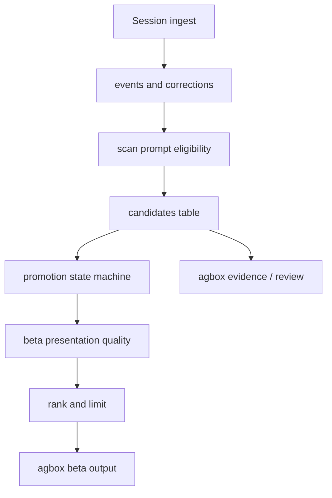

# feat: Improve beta aha candidate quality

## Summary

Make `agbox beta` feel like a product aha moment by showing a small set of useful, skill-worthy workflow candidates instead of raw repeated-session noise. The plan keeps the current local-first scanner model, adds deterministic candidate quality gates, gives recurring "current project analysis" prompts a stable identity, and makes beta fast enough to run repeatedly during onboarding.

---

## Problem Frame

The previous prompt-pattern work fixed the core discovery gap: repeated prompts such as "현재 프로젝트 분석해줘" can now become candidates even when corrections exist. The next product gap is presentation quality. Real beta output can still be dominated by generated suggestion boilerplate, file-attachment wrappers, clipboard/image/PDF prompts, long plan handoff prompts, interruption placeholders, and generic one-off requests that repeat because of tool mechanics rather than user intent.

For a customer, the aha point is not "agbox found many candidates." It is "agbox noticed the workflow I keep asking for and can turn it into reusable agent behavior." The implementation should therefore separate durable workflow signals from ingest artifacts before the first beta screen asks the user for attention.

---

## Requirements

- R1. `agbox beta` must prefer candidates that describe reusable human workflows over generated, attachment, or tool-control artifacts.
- R2. Prompt-pattern hard filters must reject obvious non-user-intent noise before it can become a new candidate.
- R3. Beta display filtering must hide or demote weak existing candidates without deleting historical evidence or mutating terminal states.
- R4. Repeated "현재 프로젝트 분석해줘" / "analyze the current project" prompts must cluster under a stable semantic key and readable candidate name.
- R5. Candidate ordering must account for source kind, semantic strength, repeat count, project spread, confidence, and last seen time instead of state plus repeat count only.
- R6. `agbox beta` must have a fast default path that avoids expensive full sync work when the watcher has synced recently, while still offering an explicit refresh path.
- R7. The beta empty and filtered-out states must tell the truth: no strong candidates yet, setup still active, and `agbox demo` / `agbox doctor` remain the safe next steps.
- R8. Tests must cover the real noisy classes seen in beta output and preserve the existing correction and prompt-pattern success paths.

---

## High-Level Technical Design

The scanner should only block artifacts that are clearly not user workflow intent. Beta should then apply a presentation-specific quality layer that can hide or demote noisy legacy candidates without losing auditability through `agbox evidence`, `agbox review`, or direct state queries.

---

## Key Technical Decisions

- KTD1. **Split hard eligibility from beta presentation quality:** Some repeated prompts should never become candidates, while others should remain reviewable but not be first-screen beta material. Keeping these layers separate avoids destructive cleanup and keeps evidence available.
- KTD2. **Use deterministic heuristics only:** This feature sits in local CLI sync and onboarding. Rule-based filters in Go are testable, private, and consistent with the existing `SemanticKey` and promotion threshold design.
- KTD3. **Name durable workflows through semantic keys:** "현재 프로젝트 분석해줘" should not surface as a long lexical slug. A stable semantic key such as `current-project-analysis` should drive the candidate name and description.
- KTD4. **Rank for user value, not just frequency:** A repeated generated prompt can have many events, but it is worse beta material than a lower-frequency semantic workflow. Beta needs a score that rewards semantic keys, correction evidence, multi-project spread, confidence, and recency while penalizing known noise shapes.
- KTD5. **Make beta fast by making only ingest stale-aware:** The watcher is now installed with keepalive and best-effort ingest, but it does not promote candidates. `agbox beta` should skip expensive ingest when source cursors are fresh while still running the cheap scan, promote, and reconcile steps before display.
- KTD6. **Do not auto-delete existing noisy candidates in this pass:** Hiding them from beta is enough for the aha flow. Destructive cleanup or automatic rejection can be a later maintenance command if needed.

---

## Implementation Units

### U1. Harden prompt-pattern noise filtering

- **Goal:** Stop obvious generated or tool-wrapper text from becoming new prompt-pattern candidates.
- **Requirements:** R2, R8
- **Dependencies:** None
- **Files:** `internal/scan/classify.go`, `internal/scan/scan_test.go`
- **Approach:** Extend `eligiblePromptEvent` and its helper functions with a named prompt-noise taxonomy. Cover file mention wrappers, Codex clipboard/image/PDF attachment prompts, generated suggestion boilerplate variants, plan handoff blobs, review boilerplate, and request-interruption placeholders. Keep each class as a small helper or table-driven marker list so future noisy examples can be added without burying intent in one large condition.
- **Test scenarios:**
  - Repeated `# Files mentioned by the user:` prompts do not create candidates.
  - Repeated clipboard, screenshot, image, PDF, and file attachment wrapper prompts do not create candidates when the wrapper dominates the signal.
  - Repeated generated suggestion prompts, including `Generate 0 to 3 hyperpersonalized suggestions...`, do not create candidates.
  - Repeated plan handoff and review-boilerplate prompts do not create candidates.
  - Repeated Korean workflow prompts such as "현재 프로젝트 분석해줘" still pass eligibility.
- **Verification:** `scan.Run` creates zero candidates for each hard-noise fixture and still creates prompt-pattern candidates for existing positive fixtures.

### U2. Add semantic identity for current-project analysis

- **Goal:** Make the user's repeated project-analysis prompt appear as a readable, high-signal workflow candidate.
- **Requirements:** R4, R5, R8
- **Dependencies:** U1
- **Files:** `internal/scan/classify.go`, `internal/scan/scan.go`, `internal/scan/scan_test.go`, `internal/propose/state/state.go`
- **Approach:** Add a semantic classifier for Korean and English variants of current-project analysis, including "현재 프로젝트 분석해줘", "현재까지의 진행사항 분석", and "analyze the current project before recommending changes." Map those prompts to `current-project-analysis`, return a workflow kind such as `current-project-analysis-workflow`, and use the existing prompt-pattern threshold rules. Do not broaden this into generic "analyze anything" matching.
- **Test scenarios:**
  - Two or more matching prompts across projects produce a prompt-pattern candidate with `SemanticKey` `current-project-analysis`.
  - Three matching prompts in one project can promote through the existing medium-confidence prompt-pattern threshold.
  - Similar but generic one-off analysis prompts without project context fall back to lexical classification or remain below threshold.
  - The candidate name is stable and not derived from a long Korean or English sentence slug.
- **Verification:** The candidate shown by scan or beta has a readable name and source kind `prompt_pattern`.

### U3. Introduce beta candidate quality scoring

- **Goal:** Make beta choose the top candidates by expected user value rather than by database ordering alone.
- **Requirements:** R1, R3, R5, R7, R8
- **Dependencies:** U1, U2
- **Files:** `internal/cli/beta.go`, `internal/cli/cli_test.go`, optional `internal/cli/candidate_quality.go`
- **Approach:** Replace `betaCandidates` append-first selection with a presentation-quality pass. Load candidates by the existing state priority, score each candidate, hide candidates classified as beta-display noise, and sort by state priority plus quality score. Reward correction-backed candidates, known semantic keys, multi-project spread, higher confidence, higher repeats, and recency. Penalize long lexical slugs, file/clipboard/image wrappers, generated prompt text, and low-confidence single-project prompt patterns. Keep hidden candidates available outside beta.
- **Test scenarios:**
  - A good correction candidate outranks high-frequency generated boilerplate.
  - A `current-project-analysis-workflow` prompt-pattern candidate appears before file-wrapper prompt candidates.
  - When all candidates are hidden as beta noise, beta prints a "No strong workflow candidates yet" style message rather than "No repeated corrections yet."
  - Existing beta correction evidence and next-action output remain unchanged for high-quality correction candidates.
  - `--limit 0` still disables candidate display without claiming there are no candidates.
- **Verification:** CLI tests assert ordering, hidden-noise behavior, and legacy beta output compatibility.

### U4. Make beta ingest stale-aware by default

- **Goal:** Reduce beta latency and make repeated onboarding checks feel responsive.
- **Requirements:** R6, R7, R8
- **Dependencies:** U3
- **Files:** `internal/cli/beta.go`, `internal/cli/cli.go`, `internal/cli/cli_test.go`, `internal/pipeline/sync.go`, `internal/pipeline/sync_test.go`, `internal/watcher/watcher.go`
- **Approach:** Add or adjust a beta-specific pipeline helper that conditionally skips session ingest when `LatestCursorSync` is fresh, then always runs `scan.Run`, `propose.PromoteAfterScan`, and `propose.ReconcileAcceptedSkills` before beta loads candidates. Add `agbox beta --sync` for a forced best-effort ingest plus scan/promote/reconcile, and update command help. Surface sync status as fresh, refreshed, partial, or skipped in setup output without exposing raw paths or prompt content.
- **Test scenarios:**
  - With a recent cursor sync, beta skips full ingest but still scans, promotes, and reconciles candidates.
  - With no cursor sync, beta performs the existing best-effort ingest path and then scans, promotes, and reconciles candidates.
  - `agbox beta --sync` forces full best-effort sync even when the cursor is fresh.
  - Partial warnings still render through `betaSyncIssue`.
  - Help output documents `--sync`.
- **Verification:** Pipeline and CLI tests prove the stale-aware path does not regress candidate display or reconciliation.

### U5. Update beta copy and documentation around curated candidates

- **Goal:** Set accurate customer expectations for the aha loop.
- **Requirements:** R1, R3, R6, R7
- **Dependencies:** U3, U4
- **Files:** `README.md`, `internal/cli/cli.go`, `internal/cli/beta.go`, `internal/cli/cli_test.go`
- **Approach:** Update beta command help and README copy from raw "best repeated workflow candidates" toward "curated repeated workflow candidates." Mention the explicit refresh path. Keep the local-first and review-first posture: agbox suggests, the user accepts, and managed hooks reconcile created skills.
- **Test scenarios:**
  - Beta help includes `--sync`.
  - Empty beta output distinguishes "no strong workflow candidates yet" from setup failures.
  - README examples still match actual CLI behavior.
- **Verification:** CLI help tests pass, and README no longer overpromises automatic skill creation.

---

## Acceptance Examples

- AE1. Given repeated generated suggestion boilerplate and repeated "현재 프로젝트 분석해줘" prompts in the store, when `agbox beta` runs, then the current-project workflow is shown and the generated boilerplate is not.
- AE2. Given repeated file attachment wrappers and one high-quality correction candidate, when `agbox beta --limit 5` runs, then the correction candidate is shown before any weak prompt-pattern candidate.
- AE3. Given a recent watcher cursor sync and unpromoted events in the store, when `agbox beta` runs, then setup output reports a fresh or skipped ingest path and beta still scans and promotes candidates before display.
- AE4. Given the same store, when `agbox beta --sync` runs, then beta forces a best-effort refresh and still applies candidate quality filtering before display.
- AE5. Given only hidden/noisy candidates, when `agbox beta` runs, then it says there are no strong workflow candidates yet and points to `agbox demo` and `agbox doctor`.

---

## Scope Boundaries

### In Scope

- Deterministic hard filters for obvious prompt-pattern noise.
- Beta-only quality scoring, hiding, and ranking.
- Semantic classification and naming for current-project analysis workflows.
- Stale-aware beta sync and an explicit refresh flag.
- README and CLI help updates for the curated beta behavior.

### Deferred

- Automatic cleanup, rejection, or migration of existing noisy candidates.
- LLM-based semantic clustering or summarization.
- Per-user candidate-quality tuning controls.
- Telemetry instrumentation for candidate impression quality.
- Full onboarding demo redesign beyond beta output and README wording.

### Outside This Product's Identity

- Uploading raw prompts to classify quality.
- Creating skills without user acceptance.
- Treating file attachments or generated system prompts as personal workflow memory.

---

## System-Wide Impact

The change affects the path from scan to beta presentation, but it should not change export safety, rollback, evidence storage, or accepted skill reconciliation. The main cross-cutting contract is that `internal/scan` owns hard candidate eligibility, while `internal/cli` owns beta presentation quality. Keeping that boundary clean prevents beta UX rules from leaking into the durable candidate model.

---

## Risks & Dependencies

- **Over-filtering real workflows:** Attachment-heavy workflows can be valid. The hard filter should target wrapper-dominated prompts, while beta display scoring can demote borderline cases instead of deleting them.
- **Ranking opacity:** A hidden or demoted candidate can confuse debugging. Tests and code comments should name each quality rule, and `agbox evidence` should still work for direct candidate IDs.
- **Sync freshness mistakes:** Stale-aware beta depends on cursor timestamps. The forced `--sync` path and setup output mitigate cases where the watcher is installed but not actually ingesting.
- **Semantic classifier drift:** The current-project classifier should start narrow. Broad analysis matching can reintroduce generic prompt noise.

---

## Sources & Research

- `internal/cli/beta.go`: beta currently runs `SyncBestEffort`, lists states in fixed priority, and accepts the store's repeat-count ordering without presentation scoring.
- `internal/scan/classify.go`: existing prompt eligibility and `SemanticKey` taxonomy are deterministic and are the right place for hard filters plus current-project semantic identity.
- `internal/scan/scan.go`: prompt-pattern candidates are built from eligible events and already carry source kind, semantic key, event count, project count, and confidence.
- `internal/propose/state/state.go`: prompt-pattern promotion thresholds already require either more repeats, medium/high confidence, or multi-project semantic evidence.
- `internal/evidence/evidence.go`: evidence rendering is already source-aware enough that this plan can preserve evidence access while beta hides noisy candidates.
- `internal/pipeline/sync.go`: `SyncBestEffortIfStale` already exists, but beta needs a variant that can skip ingest while still scanning, promoting, and reconciling.
- `internal/watcher/watcher.go`: the watcher currently performs best-effort session ingest, not scan or promotion, so beta cannot rely on watcher freshness alone for candidate readiness.
- `docs/plans/2026-06-25-001-fix-repeated-prompt-candidates-plan.md`: prior plan establishes prompt patterns as first-class candidates; this plan improves their quality and presentation.
