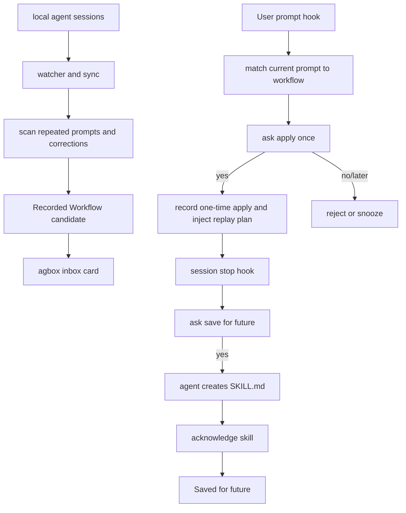
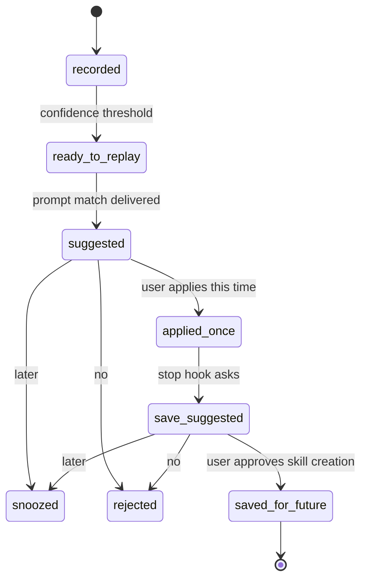

# feat: Add recorded workflow replay

## Summary

This plan turns the current candidate/proposal loop into an MVP Recorded Workflow replay loop. It keeps automatic session recording and deterministic candidate detection, adds user-facing Recorded Workflow cards, introduces one-time replay application, and uses prompt-submit hooks where supported so replay suggestions appear when the user repeats a matching command.

---

## Problem Frame

agbox already ingests local agent sessions, clusters repeated corrections and prompts, promotes strong candidates, and can ask an agent to create a skill. That proves the learning path, but the product still reads like a candidate-to-skill manager. The brainstorm reframed the product around automatic workflow record and replay: agbox notices recurring work, shows the learned plan, lets the user apply it once, and only later saves it for future use after explicit approval (see origin: `docs/brainstorms/2026-06-25-auto-workflow-record-replay-requirements.md`).

The important implementation correction from planning is that `apply once` must not create a persistent skill. It should inject instruction/context only for the current request. The next strong aha requires matching the user's next prompt at prompt-submit time, not only proposing a generic candidate at session start.

---

## Requirements

### Recorded Workflow UX

- R1. User-facing CLI, TUI, hook, and docs copy must present strong candidates as Recorded Workflows rather than promotion candidates.
- R2. A Recorded Workflow card must show name, when it applies, replay plan, evidence summary, confidence, lifecycle state, and an instruction-only safety note.
- R3. `agbox inbox` must become the primary management surface for Recorded Workflows, while `agbox beta` remains a setup/onboarding summary.
- R4. Existing evidence, review, approve, reject, snooze, export, rollback, and accepted-skill reconciliation behavior must remain available.

### Replay Matching and Apply Once

- R5. Replay matching must prefer the current user prompt/command when a supported prompt-submit hook provides it.
- R6. Prompt-triggered replay suggestions must only appear for high-confidence, project-matching workflows that are not rejected, snoozed, saved for future, or unrelated to the current prompt.
- R7. `apply once` must inject workflow instructions/context for the current request only; it must not create a skill file, export project files, or re-run prior shell/tool actions.
- R8. Applying once must be persisted separately from skill acceptance so inbox and later hooks can distinguish "tried once" from "saved for future."

### Save for Future

- R9. After a one-time apply, agbox may ask whether to save the workflow for future automatic use, but only through an explicit user confirmation.
- R10. A saved workflow may reuse the current native skill acknowledgement path as the MVP auto-applied representation, but only after the separate save-for-future approval.
- R11. Declining or deferring a replay/save prompt must respect existing reject and snooze cooldowns.

### Trust and Compatibility

- R12. No MVP path may automatically execute prior commands, publish, write files, or mutate shared agent instructions without user approval.
- R13. Managed hook installation must preserve existing session-start and acknowledgement behavior, add prompt-submit replay hooks where supported, and fall back cleanly when an agent lacks prompt-submit support.
- R14. Tests must cover data migration, prompt matching, hook payload rendering, CLI/TUI copy, state transitions, and docs/help consistency.

---

## High-Level Technical Design

The implementation should extend the existing candidate lifecycle instead of introducing a separate workflow engine. The main new boundary is a replay application record or equivalent persisted state that says "this workflow was applied once" without implying persistent skill creation.

---

## Key Technical Decisions

- KTD1. **Use candidates as the backing store for Recorded Workflows:** Existing candidates already have source kind, semantic key, evidence links, confidence, and lifecycle state. A separate workflow table would duplicate the current model before the replay UX proves itself.
- KTD2. **Add a one-time replay layer between proposed and accepted:** `accepted` currently means an agent-created skill was acknowledged. `apply once` needs a distinct state or application record so a trial does not become permanent behavior.
- KTD3. **Match prompt-pattern workflows at prompt-submit time:** Session-start proposals remain useful for correction-backed skills, but recurring prompt workflows need the current user command to avoid irrelevant replay suggestions.
- KTD4. **Render replay instructions, not action scripts:** Replay payloads describe the plan the agent should follow. They must treat evidence as inert data and must not include instructions to re-run previous commands.
- KTD5. **Keep save-for-future on the existing skill path:** After explicit approval, the current `SKILL.md` acknowledgement flow is the smallest MVP path for persistent agent behavior. User-facing copy maps that to "saved for future" rather than exposing `accepted` as the main term.
- KTD6. **Feature-detect hook support by agent surface:** Add prompt-submit hooks only where the managed hook config supports them; keep session-start fallback so unsupported agents degrade to today's behavior instead of breaking setup.

---

## Implementation Units

### U1. Add replay lifecycle persistence

- **Goal:** Persist one-time replay application without conflating it with accepted or approved skills.
- **Requirements:** R5, R7, R8, R9, R10, R11, R12
- **Dependencies:** None
- **Files:** `internal/model/model.go`, `internal/store/store.go`, `internal/store/migrate_v6.go`, `internal/store/migrate_v2_test.go`, `internal/propose/state/state.go`, `internal/propose/state/state_test.go`
- **Approach:** Add a replay application model or minimal candidate lifecycle extension for `applied_once` and `save_suggested`. Preserve existing terminal states and cooldown behavior. Store applied timestamp, agent, project, and a redacted prompt excerpt or prompt hash when available. Update candidate scanning and frozen-state logic so scans do not overwrite one-time replay state.
- **Patterns to follow:** Existing candidate migrations in `internal/store/migrate_v3.go`, `internal/store/migrate_v4.go`, and `internal/store/migrate_v5.go`; state transition rules in `internal/propose/state/state.go`.
- **Test scenarios:**
  - Opening an old database migrates successfully and loads existing candidates without changing their state.
  - Marking a workflow as applied once persists the state/application metadata and reloads it from the store.
  - A subsequent scan does not demote `applied_once`, `save_suggested`, `accepted`, `rejected`, or `snoozed` workflows.
  - Reject and snooze cooldowns still recover eligible workflows after their existing windows.
  - Existing accepted-skill reconciliation still moves a proposed or save-suggested workflow to the saved-for-future representation.
- **Verification:** Store and state tests prove one-time apply is durable and separate from skill acknowledgement.

### U2. Build Recorded Workflow card formatting

- **Goal:** Centralize user-facing Recorded Workflow presentation so CLI, TUI, beta, evidence, and hook payloads use consistent terminology.
- **Requirements:** R1, R2, R3, R4, R12
- **Dependencies:** U1 for lifecycle labels when available
- **Files:** `internal/workflow/card.go`, `internal/workflow/card_test.go`, `internal/evidence/evidence.go`, `internal/evidence/evidence_test.go`, `internal/compile/compile.go`, `internal/compile/compile_test.go`
- **Approach:** Create a small formatter that derives `When it applies`, `Replay plan`, `Evidence`, `Lifecycle`, and `Safety` from `model.Candidate` plus `model.EvidenceCard`. Use known semantic keys for richer plans, especially current-project analysis, package-manager preferences, PR summary format, and API/OpenAPI sync. Fall back to existing description and rule text for unknown workflows.
- **Patterns to follow:** Existing deterministic semantic taxonomy in `internal/scan/classify.go`; evidence reason construction in `internal/evidence/evidence.go`; skill body rendering in `internal/compile/compile.go`.
- **Test scenarios:**
  - A `current-project-analysis` prompt-pattern candidate renders a named workflow with a multi-step replay plan and no action replay promise.
  - A correction-backed package-manager candidate renders causal evidence and a plan that avoids prior wrong commands.
  - A lexical fallback candidate renders a conservative plan without inventing unsupported steps.
  - The safety note says replay injects instructions only and does not re-run commands.
  - Existing compile output for approved workflows keeps `agbox_candidate_id` compatibility when skill text is rendered later in the flow.
- **Verification:** Formatter tests protect user-facing labels and prevent `candidate`/`promotion` copy from leaking into Recorded Workflow card surfaces.

### U3. Make inbox the Recorded Workflow management surface

- **Goal:** Move primary workflow review from "Promotion Inbox candidates" to `agbox inbox` Recorded Workflow cards.
- **Requirements:** R1, R2, R3, R4, R11, R14
- **Dependencies:** U1, U2
- **Files:** `internal/cli/cli.go`, `internal/cli/beta.go`, `internal/cli/cli_test.go`, `internal/tui/review.go`, `internal/tui/review_test.go`
- **Approach:** Have `agbox inbox` run the same stale-aware sync/scan/promote/reconcile path needed for current data, then print compact Recorded Workflow cards with state, confidence, evidence summary, replay plan, and safe next actions. Keep `agbox review` as the deeper TUI surface, but update labels from candidates/rules toward workflows/plans. Keep `agbox beta` focused on setup health plus a pointer to `agbox inbox`.
- **Patterns to follow:** `runBeta` stale-aware sync flow in `internal/cli/beta.go`; `runDiscover` card-style output in `internal/cli/cli.go`; `ReviewService.Load` scan/reload behavior in `internal/tui/review.go`.
- **Test scenarios:**
  - Empty `agbox inbox` says no Recorded Workflows yet and points to normal agent use, demo, and doctor without database-looking output.
  - A current-project workflow appears with name, when-it-applies text, replay plan, evidence summary, confidence, and safety note.
  - `agbox inbox --state applied_once` or equivalent state filtering shows one-time applied workflows.
  - `agbox beta` still shows setup status but directs workflow management to `agbox inbox`.
  - TUI render uses Recorded Workflow labels while preserving navigation, project filter, evidence drill-down, approve/reject, and export paths.
- **Verification:** CLI and TUI tests assert the new card shape and ensure existing review/export flows still work.

### U4. Add prompt-submit replay hook support

- **Goal:** Use the user's current prompt as the matching input for replay suggestions when an agent exposes a prompt-submit hook.
- **Requirements:** R5, R6, R7, R12, R13, R14
- **Dependencies:** U1, U2
- **Files:** `internal/connect/connect.go`, `internal/connect/hookspec.go`, `internal/connect/connect_test.go`, `internal/propose/propose.go`, `internal/propose/propose_test.go`, `internal/cli/hook.go`, `internal/cli/cli_test.go`
- **Approach:** Add a replay-oriented hook path for prompt-submit events where supported by the managed agent config. Parse hook input for cwd/project and prompt text using agent-specific fixtures plus conservative generic fields. Match prompt text against candidate semantic keys, normalized prompt hashes, source kind, project evidence, confidence, and cooldown state. If prompt text is missing, fall back to today's project-only selection or emit nothing.
- **Patterns to follow:** Managed hook generation in `internal/connect/hookspec.go`; project matching in `internal/propose/propose.go`; prompt semantic key logic in `internal/scan/classify.go`; existing hook tests in `internal/connect/connect_test.go` and `internal/propose/propose_test.go`.
- **Test scenarios:**
  - Managed hook config preserves existing unrelated hooks and adds a prompt-submit replay hook for supported agents.
  - Unsupported agents keep session-start proposal and acknowledgement hooks without adding invalid prompt-submit events.
  - A hook payload containing "현재 프로젝트 분석해줘" selects the matching current-project workflow instead of the highest-count unrelated candidate.
  - A prompt with no semantic or normalized match emits no replay payload.
  - Rejected, snoozed, saved-for-future, and low-confidence single-project prompt workflows are not suggested.
  - Missing or malformed hook JSON returns no payload and no user-visible error.
- **Verification:** Hook config and proposal tests prove prompt-triggered replay is specific to the current user command and safe when prompt data is unavailable.

### U5. Render and apply one-time replay plans

- **Goal:** Replace immediate skill-creation proposal copy with an apply-once replay suggestion for prompt-triggered workflows.
- **Requirements:** R6, R7, R8, R11, R12, R14
- **Dependencies:** U1, U2, U4
- **Files:** `internal/propose/injection.go`, `internal/propose/acknowledge.go`, `internal/propose/propose.go`, `internal/cli/propose_cmds.go`, `internal/cli/hook.go`, `internal/propose/propose_test.go`, `internal/cli/cli_test.go`
- **Approach:** Add a replay payload renderer that tells the agent to ask one short question: apply this replay plan for the current request? If the user says yes, the agent should follow the plan for this request only and mark the workflow applied once through an agbox command. If the user says no or later, reuse reject/snooze. Preserve inert evidence handling, hidden candidate markers, and stdout-before-state-mutation safety.
- **Patterns to follow:** `RenderInjection` marker and inert-evidence handling in `internal/propose/injection.go`; `DeliverProposed` write-then-mark behavior in `internal/propose/propose.go`; existing `reject`, `snooze`, and `accept` commands in `internal/cli/propose_cmds.go`.
- **Test scenarios:**
  - Replay payload includes the candidate marker, workflow name, replay plan, evidence summary, safety note, and apply/no/later handling.
  - Replay payload does not tell the agent to create a `SKILL.md` on apply-once approval.
  - Dangerous evidence such as command snippets, comments, and HTML is escaped as inert data.
  - The new apply command records `applied_once` only after explicit user approval.
  - Delivery failure does not mutate state; successful delivery moves only to the suggested/proposed state.
  - Existing skill proposal behavior remains available for save-for-future prompts.
- **Verification:** Snapshot-style proposal tests make the distinction between "apply once" and "save for future" visible.

### U6. Add explicit save-for-future prompt after apply once

- **Goal:** Let users promote a tried workflow to persistent agent behavior only after the separate save approval.
- **Requirements:** R8, R9, R10, R11, R12, R14
- **Dependencies:** U1, U2, U5
- **Files:** `internal/propose/propose.go`, `internal/propose/injection.go`, `internal/propose/acknowledge.go`, `internal/cli/hook.go`, `internal/propose/propose_test.go`, `internal/cli/cli_test.go`, `internal/tui/review.go`, `internal/tui/review_test.go`
- **Approach:** At a natural stop/session boundary, select recently applied-once workflows and render a save-for-future prompt. This prompt may use the existing skill creation instructions and acknowledgement path, but the copy must say it saves the recorded workflow for future use. If the user declines or defers, reuse reject/snooze. If a native skill file with `agbox_candidate_id` is acknowledged, map the workflow to the saved-for-future lifecycle label.
- **Patterns to follow:** Current `hook propose` use on `Stop`; `Acknowledge` skill-path validation in `internal/propose/acknowledge.go`; accepted-skill reconciliation in `internal/propose/reconcile.go`.
- **Test scenarios:**
  - A recently applied-once workflow can produce a save-for-future prompt at stop.
  - A workflow that has not been applied once is not promoted to save-for-future solely because it is high confidence.
  - Save prompt copy asks for future reuse and includes native skill creation requirements.
  - Acknowledging a skill file after save approval maps the workflow to saved-for-future/accepted.
  - Rejected and snoozed save prompts do not reappear before cooldown expiry.
- **Verification:** Proposal and TUI tests show the lifecycle distinction: recorded, suggested, applied once, save suggested, saved for future.

### U7. Update public copy and command help

- **Goal:** Align docs, help, and package copy with automatic record plus instruction-only replay.
- **Requirements:** R1, R2, R3, R7, R9, R10, R12, R13, R14
- **Dependencies:** U3, U4, U5, U6
- **Files:** `README.md`, `npm/cli/README.md`, `npm/cli/package.json`, `internal/cli/cli.go`, `internal/cli/cli_test.go`, `docs/superpowers/specs/2026-06-22-session-watcher-design.md`
- **Approach:** Update quick start and command reference so `agbox inbox` is the workflow-management command, `agbox beta` is setup/onboarding, and replay is described as instruction/context injection. Explicitly state that agbox does not re-run prior commands or write persistent skills without approval. Keep local-first privacy language and managed hook disclosure precise.
- **Patterns to follow:** Existing README "30-second aha", "How it works", "Features", and command reference sections.
- **Test scenarios:**
  - CLI help for `inbox`, `beta`, `hook`, and replay/apply commands matches the implemented command surface.
  - README examples use commands and output labels that exist in CLI tests.
  - No docs describe `apply once` as creating a skill or imply action replay.
  - npm package description remains accurate for local-first workflow memory.
- **Verification:** Docs and help are consistent with CLI snapshot tests and the brainstorm scope.

---

## Acceptance Examples

- AE1. Given repeated "현재 프로젝트 분석해줘" prompts in the store, when the user submits the same prompt through a supported prompt hook, agbox suggests applying the Current Project Analysis replay plan before work starts.
- AE2. Given the user approves apply once, the agent receives instruction-only replay guidance and agbox records an applied-once event without creating `SKILL.md`.
- AE3. Given a workflow was applied once, when the session reaches a natural stop, agbox asks whether to save the workflow for future use.
- AE4. Given the user approves save for future and the agent creates a skill containing `agbox_candidate_id`, acknowledgement marks the workflow saved for future.
- AE5. Given a rejected or snoozed workflow, prompt-submit hooks do not suggest it again before the cooldown expires.
- AE6. Given a workflow card in `agbox inbox`, the user can see when it applies, the replay plan, evidence, confidence, lifecycle state, and that no commands are replayed automatically.
- AE7. Given an unsupported prompt hook surface, managed hook installation does not break and agbox falls back to the existing session-start proposal path.

---

## Scope Boundaries

### In Scope

- Recorded Workflow terminology and cards backed by existing candidates.
- `agbox inbox` as the primary workflow review and management surface.
- Prompt-submit hook replay matching where supported.
- One-time replay application through instruction/context injection.
- Explicit save-for-future prompt after one-time apply.
- Native skill acknowledgement as the MVP saved-for-future representation.
- CLI, TUI, hook, store, and docs tests for the replay lifecycle.

### Deferred to Follow-Up Work

- Implicit success scoring after apply once.
- Full action replay or command replay.
- A separate workflow rule engine independent of native skills.
- LLM-generated replay plan synthesis beyond deterministic semantic templates.
- Rich visual workflow builder or GUI.
- Cloud sync, team workflow memory, and cross-machine sharing.
- Manual `agbox replay <id>` as the primary command.

### Outside This Product's Identity

- Hidden automation that executes commands or edits files without user approval.
- Uploading prompts, session transcripts, repository paths, or workflow content for remote matching.
- Treating every repeated prompt as replay-worthy without evidence of a reusable workflow.

---

## System-Wide Impact

- **Persistent state:** The candidate lifecycle gains a one-time replay state or application log. Migrations and scan merge rules must preserve existing stores.
- **Agent surfaces:** Managed hooks gain a prompt-submit path where supported. Hook output becomes more timing-sensitive because it is tied to the current user prompt.
- **Trust boundary:** Replay copy must repeatedly reinforce instruction-only behavior. Persistent skill creation remains a separate approval.
- **CLI contract:** `agbox inbox` becomes a primary command, and `agbox beta` becomes secondary onboarding.
- **Review surfaces:** TUI and evidence views must use the same lifecycle labels as CLI cards so users can recover from any hook suggestion.

---

## Risks & Dependencies

- **Prompt hook availability differs by agent:** Some agents may not expose a stable prompt-submit hook. The managed hook layer should add prompt hooks only where supported and keep current session-start fallback.
- **False-positive replay suggestions:** Matching only by top candidate would annoy users. Prompt-triggered matching must require semantic, normalized, or project-grounded evidence.
- **Apply-once/persistent confusion:** If copy or state transitions blur "apply once" and "save for future," users may feel agbox wrote durable behavior too early. Separate lifecycle labels and tests mitigate this.
- **State machine complexity:** Adding replay states can make inbox harder to understand. Use user-facing labels and keep internal candidate states as implementation details where possible.
- **Hook payload injection risk:** Evidence and prior prompts are untrusted session data. Reuse inert evidence escaping and avoid copying raw instructions into executable-looking blocks.

---

## Sources & Research

- `docs/brainstorms/2026-06-25-auto-workflow-record-replay-requirements.md`: origin product requirements for automatic record, instruction-only replay, inbox management, apply once, and explicit auto-apply confirmation.
- `internal/model/model.go`: existing candidate states and source kinds.
- `internal/store/store.go`: candidate persistence, migrations, and metadata update patterns.
- `internal/propose/state/state.go`: promotion thresholds, frozen states, cooldowns, and proposed TTL behavior.
- `internal/propose/propose.go`: candidate selection, project matching, delivery, and proposed-state marking.
- `internal/propose/injection.go`: current proposal payload, inert evidence escaping, and native skill instructions.
- `internal/connect/hookspec.go`: managed hook event installation and command generation.
- `internal/cli/cli.go` and `internal/cli/beta.go`: command routing, inbox, review, beta, and help copy.
- `internal/tui/review.go`: interactive review surface, state badges, evidence rendering, and export flow.
- `docs/plans/2026-06-23-001-feat-beta-aha-loop-plan.md`: existing beta proposal lifecycle and trust posture.
- `docs/plans/2026-06-25-001-fix-repeated-prompt-candidates-plan.md`: prompt-pattern candidate source and source-aware evidence plan.
- `docs/plans/2026-06-25-002-feat-beta-aha-quality-plan.md`: current-project-analysis semantic key and candidate quality gates.
