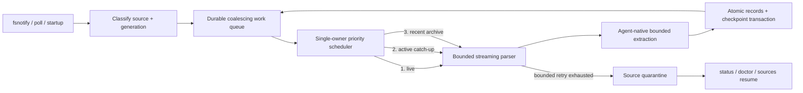

# Bounded Session Ingestion Redesign - Plan

## Goal Capsule

- **Objective:** Replace corpus-proportional, overlapping session ingestion with one crash-safe, bounded-memory scheduler that keeps new corrections queryable within the defined latency SLO.
- **Authority:** The Product Contract and its confirmed memory, latency, retention, failure-isolation, privacy, and destructive-reset decisions override implementation convenience.
- **Execution profile:** Code change across discovery, parsing, SQLite persistence, watcher orchestration, CLI/TUI diagnostics, retention, and performance tests.
- **Stop conditions:** Stop rather than weaken the plan if the implementation cannot preserve the 200 MB processing RSS ceiling, the single-owner invariant, atomic checkpoint semantics, or the no-raw-transcript boundary.
- **Tail ownership:** The implementation owner carries this plan through local verification, review, shipping, and CI after the planning and document-review gates pass.

---

## Product Contract

**Product Contract preservation:** unchanged. Planning clarifies implementation behavior at startup, across processes, and at existing CLI boundaries without changing the confirmed product scope.

### Summary

agbox can consume tens of gigabytes of memory because its session watcher violates the intended incremental-ingestion contract in three compounding ways: source discovery includes large archived Codex histories, adapters load each entire JSONL file before parsing, and watcher triggers can overlap repeated all-source ingestion passes. A cursor at EOF currently does not prevent the file from being read and replayed for context.

This plan replaces that path with a single-owner, durable ingestion scheduler. The scheduler coalesces file-change signals, processes one bounded streaming slice at a time, prioritizes new live records, and performs recent-history catch-up only while idle. Checkpoint advancement and normalized correction writes become one atomic operation. The redesign preserves the local-first privacy boundary while enforcing explicit memory, latency, crash-recovery, and observability contracts.

This is an intentionally breaking migration. On first launch of the redesigned version, agbox deletes the existing database without backup or rollback and starts from an empty store.

---

### Problem Frame

#### Observed resource profile

The read-only investigation on 2026-07-15 found:

- The machine has 32 GB of physical memory, while agbox was reported at roughly 40 GB of memory pressure.
- The current Codex corpus contains 2,117 JSONL files totaling about 11.273 GiB.
- `archived_sessions` accounts for 1,079 files and about 9.495 GiB; active `sessions` accounts for 994 files and about 1.781 GiB.
- The incident database contained cursors for 1,251 Codex files totaling about 10.521 GiB, including 478 archived files totaling about 9.191 GiB.
- The largest observed JSONL file is about 838.4 MiB. Its largest individual line is about 27.9 MiB.
- Parsing that one 838.4 MiB file used about 1.870 GB maximum RSS on the first pass.
- Parsing the same file with its cursor already at EOF still used about 1.867 GB maximum RSS and took about 8.81 seconds.
- Parsing three large archived files in one probe reached about 2.446 GB maximum RSS.
- Watcher logs contained 260 completed all-source passes across initial, polling, and debounced triggers, plus repeated source and foreign-key errors.

These measurements explain how overlapping passes over a multi-gigabyte corpus can drive aggregate memory pressure far beyond the physical-memory size even though a single isolated pass does not itself reach 40 GB.

#### Root-cause chain

1. `internal/session/codex/adapter.go` recursively walks the full Codex root and does not exclude `archived_sessions`.
2. Claude, Codex, and Grok adapters call `io.ReadAll` before parsing, so resident memory scales with source-file size rather than appended-data size.
3. `internal/session/jsonl/loop.go` starts from byte zero and invokes context handling for every pre-cursor line. A cursor at EOF therefore still performs a full read and replay.
4. `internal/watcher/watcher.go` can start all-source ingestion from initial startup, polling, and a `time.AfterFunc` debounce callback without one owner or one in-flight guard.
5. A single file event can consequently trigger discovery and parsing across every source, while another trigger begins the same work before the prior pass finishes.
6. The Codex adapter currently feeds real Codex JSONL through `AnthropicHandler`; the checked-in Codex fixture does not represent the observed `response_item` and `event_msg` records. This creates correctness risk in addition to the memory failure.
7. Watch refresh adds newly discovered directories but does not establish a complete remove/reconcile lifecycle for stale directories and moved/deleted sources.

#### Contract mismatch

The approved watcher design in `docs/superpowers/specs/2026-06-22-session-watcher-design.md` promises cursor-based incremental parsing, local source files as the source of truth, no full transcript copies, and bounded redacted excerpts. The current implementation retains the cursor in SQLite but does not use it to bound file I/O or memory. This plan restores that contract and makes it testable.

---

### Product Decisions

- **Redesign depth:** replace the ingestion architecture rather than applying only a narrow memory patch.
- **Default history policy:** automatically process only the most recent 90 days of pre-existing history, regardless of project.
- **Live exception:** always process newly appended records from a currently active source even when the file itself is older than 90 days.
- **Archive behavior:** process eligible archived history automatically during idle time; do not require a manual backfill command.
- **Priority:** new live records always preempt active-directory catch-up and archive catch-up.
- **Data preservation:** coalesce redundant scheduling signals, never intentionally discard an eligible source record.
- **Failure isolation:** after bounded retries, quarantine only the failing source; healthy sources continue.
- **Crash recovery:** durable records must have neither gaps nor duplicates after restart.
- **Resource policy:** at most one ingest operation may execute at once; idle RSS must remain at or below 50 MB and processing RSS at or below 200 MB.
- **Freshness policy:** a newly written eligible correction must be queryable from `beta`/replay surfaces within p95 2 seconds and p99 5 seconds under the defined reference load.
- **Oversized records:** extract only required fields; never materialize irrelevant large payloads. A correction-relevant field above the existing 64 KiB signal limit quarantines the source.
- **Retention:** corrections older than 90 days stop influencing candidate generation and scoring; retain only the minimum metadata needed for deduplication and diagnostics.
- **Migration:** delete the existing database immediately on upgrade, with no backup and no rollback path.

---

### Requirements

#### Source discovery and lifecycle

- R1. Each adapter must declare its official active-session roots and archive roots explicitly. Generic recursive walking of an agent's entire configuration directory is prohibited. Discovery and parsing accept only regular files that remain canonically contained within a declared root, use no-follow open semantics, and revalidate file identity after open.
- R2. Backup, cache, temporary, and unrelated directories must be excluded structurally rather than by incidental filename checks.
- R3. Pre-existing files in both active and archive roots are automatically eligible only when trustworthy adapter-specific, non-content metadata places their source session within the most recent 90 days. Generic filesystem modification time alone must not prove historical eligibility. Sources without trustworthy session-time evidence are skipped for catch-up; old active files still baseline at EOF so future appends remain live-eligible. The default window must be configurable.
- R4. A newly appended record in a watched active source is always eligible, even if the source file or session began more than 90 days ago.
- R5. Source identity must distinguish a continuing file from a replacement generation after truncate, rotation, or path reuse.
- R6. Rename, move, deletion, truncate, and replacement must have explicit lifecycle behavior. Stale watch registrations and stale runnable work must be removed or tombstoned.
- R7. Discovery must remain bounded in memory for at least 10,000 sources and must not read source contents merely to decide eligibility.

#### Scheduling and priority

- R8. All ingestion work must be owned by one scheduler with a durable SQLite-backed work queue or equivalent durable state machine.
- R9. Only one source-ingestion slice may execute at a time. Startup, polling, file events, CLI sync, and fallback recovery may enqueue work but may not execute parallel ingestion paths.
- R10. Repeated events for the same source and generation must coalesce into one pending work item while preserving the highest observed target position. Coalescing signals must not skip records.
- R11. Work priority must be: new live append, recent active-root catch-up, then recent archive catch-up.
- R12. The watcher must become ready for new live events before historical catch-up begins after install, reset, or restart.
- R13. Catch-up work must run in bounded, resumable slices capped by elapsed time, input bytes, and completed records. The scheduler must check for live work at every safe record boundary, and the characterized maximum single-record monopolization time must leave enough budget for the live latency SLO.
- R14. The polling fallback may reconcile metadata and enqueue changed sources, but it must not initiate an unconditional all-source parse.
- R15. Scheduler queue depth and metadata must be bounded by unique source generations rather than raw event count.

#### Incremental streaming and parsing

- R16. Parsing must seek or open at the last committed byte checkpoint and read only uncommitted bytes. No adapter may call `io.ReadAll` on a session source.
- R17. A checkpoint at the current durable EOF must result in no JSON replay and memory usage independent of total file size.
- R18. The parser must preserve an incomplete trailing JSONL record without advancing past it and complete that record after later bytes arrive.
- R19. Each runnable adapter must parse its real agent-native schema. Codex fixtures must include representative `response_item`, `event_msg`, tool, assistant, and user records from supported Codex formats. Cursor remains explicitly unsupported and non-runnable until its native parser contract and realistic fixtures exist.
- R20. Parsers must extract only fields required for session identity, role, correction detection, timestamps, and bounded evidence. Large irrelevant tool results, images, encoded blobs, and nested payloads must be skipped without materialization. Enforce calibrated limits for JSON depth, tokens and bytes examined per record, and per-slice CPU or wall time so bounded cancellation can quarantine the source at its last committed checkpoint.
- R21. Correction-relevant text remains subject to `privacy.MaxSignalBytes` (64 KiB). Exceeding that limit is a diagnosable source failure and must not be handled by exceeding the RSS budget.
- R22. A single malformed record may receive bounded retries. Repeated or unrecoverable parsing failure quarantines the source at its last committed checkpoint without advancing over the failing record.
- R23. The redesigned path must not copy a raw transcript to SQLite or to a temporary spool file.

#### Durability, deduplication, and recovery

- R24. Normalized session/turn/action/correction writes and the corresponding source checkpoint must commit in one SQLite transaction.
- R25. Every durable extracted record must have a stable idempotency identity derived from source generation and source position or an equally deterministic agent-native identity.
- R26. Retrying a committed work slice after a crash must not create duplicate turns, actions, corrections, candidates, or evidence links.
- R27. A crash before commit must leave the prior checkpoint intact so the complete slice is retried.
- R28. Restart must recover pending live and catch-up work from durable scheduler state without requiring a full content scan.
- R29. Quarantining one source must not block other active sources. Source ordering must remain strict within the quarantined source until external correction and `sources resume`.
- R30. `sources resume` must be explicit, idempotent, and continue from the last committed checkpoint rather than silently skipping the bad record.

#### Historical eligibility and retention

- R31. The automatic catch-up cutoff defaults to 90 days and applies to pre-existing files in both active and archive roots.
- R32. Historical work outside the configured cutoff must not be enqueued automatically.
- R33. Archive catch-up runs only when no live work is pending and yields when live work arrives.
- R34. Eligible archive progress must survive restart, sleep, process termination, and live-work preemption.
- R35. Once a correction becomes older than the configured 90-day active window, it must no longer contribute to candidate generation, confidence, ranking, replay matching, or evidence shown as current support.
- R36. Aging cleanup may retain only the minimum identity, timestamp, source, and diagnostic state required for deduplication and audit. It must not retain the old correction as active recommendation evidence.

#### Health and operator experience

- R37. `agbox status` and `agbox doctor` must report scheduler state, live queue depth, oldest live lag, catch-up queue depth, current source, current work class, last committed progress, and last successful ingest time.
- R38. Health output must list quarantined sources with agent, privacy-safe path/context, last committed position, failure class, retry count, and the exact `sources resume` action.
- R39. Health output must distinguish `healthy`, `catching_up`, `degraded`, and `stalled`; having optional low-priority catch-up work alone is not an error.
- R40. Archive/initial catch-up progress must be visible without printing raw transcript content.
- R41. A live-latency SLO breach, queue starvation, repeated scheduler restart, or RSS-budget violation must be observable in doctor/debug output.

#### Resource and performance contracts

- R42. Steady-state watcher RSS with no pending work must be no more than 50 MB on the supported macOS arm64 build.
- R43. Watcher RSS during normal live or catch-up processing must be no more than 200 MB, including a source containing an 838 MiB JSONL file and irrelevant individual records of at least 32 MiB.
- R44. Total memory use must remain bounded by configured parser and queue limits, not by total corpus size, largest file size, number of historical lines, or number of redundant file events.
- R45. Under a reference corpus of 2,500 live files totaling 5 GiB, while 50 eligible records per second are appended for 60 seconds, records must become queryable by `beta`/replay consumers within p95 2 seconds and p99 5 seconds.
- R46. The reference-load test must run while eligible catch-up work exists, proving that live work preempts catch-up without data loss.
- R47. An unchanged file whose checkpoint equals EOF must complete its no-op handling without reading file contents and without RSS growth proportional to file size.

#### Migration and compatibility

- R48. The first run of the redesigned storage version must delete the existing agbox database and create a clean schema. Before deleting any database, WAL, or shared-memory target, agbox must reject symlinks and non-regular files and verify a complete legacy agbox schema fingerprint or current generation marker through a read-only open; an unknown target aborts the reset. It must not create a backup or offer rollback.
- R49. The destructive reset must be version-gated and idempotent so every installation resets once rather than on every launch.
- R50. After reset, live watching must become ready before recent-history catch-up begins.
- R51. Existing workflow, correction, candidate, evidence, cursor, and scheduler records are intentionally not preserved across this migration.
- R52. Release notes and first-run output must state that local agbox history was reset, without implying recovery is available.

#### Privacy and trust

- R53. Session files remain the local source of truth. No new cloud upload, raw transcript table, or raw transcript debug bundle may be introduced.
- R54. Persisted evidence remains bounded and redacted according to the existing privacy contract.
- R55. Errors, metrics, logs, status, and doctor output must not contain raw record bodies, prompts, tool results, secrets, or encoded payloads.

#### Cross-process and consumer contracts

- R56. The single-owner invariant applies across watcher, polling, CLI sync, initialization, and recovery processes; a process-local mutex is insufficient.
- R57. Live readiness requires active-root watch registration followed by a metadata reconciliation barrier, and appends at every startup boundary must be processed once.
- R58. CLI sync paths may enqueue or wait on durable scheduler work but may not parse files or advance checkpoints independently.
- R59. Prompt-submit replay hooks must query committed state only and must never run discovery, sync, catch-up, or ingestion.
- R60. A parser checkpoint must include bounded, versioned continuation context sufficient to preserve correction linking across slices and restart without replaying committed history.
- R61. Identical source bytes must produce identical durable identities and normalized results across live, catch-up, CLI sync, slice-boundary, and crash-recovery paths.
- R62. The queryable latency boundary is reached only when the correction and its consumer visibility watermark are committed so `beta` and replay queries can observe it.
- R63. `beta` and replay consumers must distinguish complete-empty results from pending live work, incomplete catch-up, and relevant-source quarantine.
- R64. Status, doctor, debug bundle, sync receipts, and recovery commands must derive from one versioned, privacy-safe ingestion-health projection.
- R65. Quarantine resume must address an opaque source ID and expected generation, retry from the last committed checkpoint, and reject a replaced generation.
- R66. Diagnostic collection is partial: failure to read one metric must not hide independently available watcher, queue, checkpoint, quarantine, or last-commit data.
- R67. Aging must replace active correction/evidence links and deactivate candidates that no longer satisfy current evidence thresholds rather than filtering only one scan query.
- R68. Legacy reset must coordinate concurrent openers and remove the SQLite database, WAL, and shared-memory files as one version-gated transition before creating the new schema.

### Acceptance Examples

- AE1. Given an 838 MiB source whose committed checkpoint equals EOF, a poll or duplicate event reads no historical content and stays within the 200 MB RSS ceiling.
- AE2. Given recent archive work is running, 50 eligible live records per second preempt it and become queryable within p95 2 seconds and p99 5 seconds without losing archive progress.
- AE3. Given 100,000 events for one unchanged source, the durable queue retains one target for that source generation and one ingest owner executes it.
- AE4. A crash before commit retries the complete slice; a crash after commit creates no duplicate durable records.
- AE5. An incomplete final JSONL record remains before the checkpoint and is processed once after later bytes complete it.
- AE6. A 32 MiB irrelevant payload is skipped within budget, while correction-relevant text above 64 KiB quarantines only that source.
- AE7. Pre-existing active and archive sources outside 90 days are not queued, but a later append to an old active source is processed as live.
- AE8. When a correction crosses the 90-day boundary, it no longer affects candidate confidence, evidence, or replay matching.
- AE9. The first redesigned launch deletes the legacy DB without backup, creates the new schema once, becomes live-ready, and catches up recent history in the background.
- AE10. Real Codex `response_item` and `event_msg` fixtures normalize correctly without the Anthropic handler.
- AE11. Concurrent watcher and CLI sync processes produce one fenced owner, one durable result, and a receipt that distinguishes accepted from completed work.
- AE12. An append made before watch registration, between registration and baseline reconciliation, or during initial catch-up appears once within the live SLO.
- AE13. Human and machine-readable status/doctor output agree while exposing no raw path, project name, prompt, tool result, or reversible transcript-derived identifier.
- AE14. A correction appended immediately after an old active source is baselined at EOF either links through a capped backward context seed or quarantines at that record without advancing.
- AE15. A copied archive with a recent mtime but no trustworthy recent session timestamp is not queued, while a later active append remains eligible.
- AE16. A symlink beneath a declared session root, a discovery-to-open path replacement, and an unknown custom database target all fail closed without reading or deleting the target.
- AE17. Deeply nested or token-amplified JSON cannot monopolize the scheduler beyond the calibrated work budget and quarantines without checkpoint advancement.

### Scope Boundaries

#### In scope

- Replace watcher-to-parser orchestration, discovery, streaming parsers, durable scheduling, atomic checkpoints, quarantine/recovery, recent-history retention, and ingestion health surfaces.
- Preserve plain CLI and interactive Workspace semantics through one shared diagnostics projection.
- Reset the legacy database once without backup.

#### Deferred to Follow-Up Work

- User-facing tuning UI for the 90-day window, semantic/adaptive history selection, Cursor-native parsing, parallel ingestion, cloud/team state, and dedicated MCP wrappers.

#### Outside this product's identity

- Full-history automatic ingestion, corpus-proportional memory, raw-transcript spooling, skipping failed records, agent-only quarantine bypasses, or legacy database preservation.

---

## Planning Contract

### High-Level Technical Design

```mermaid
stateDiagram-v2
  [*] --> Pending
  Pending --> Running: scheduler selects highest priority
  Running --> Pending: slice committed; more bytes remain
  Running --> Complete: committed target reached
  Running --> Pending: live work preempts catch-up
  Running --> Quarantined: bounded retries exhausted
  Quarantined --> Pending: explicit sources resume
  Complete --> Pending: later append or new target
```

#### Scheduling model

File-system events are hints, not work executors. Every trigger resolves a stable source generation and raises that source's durable target position. The queue holds at most one runnable item per source generation and upgrades that item's work class to the highest applicable priority. One scheduler owns state transitions and leases one bounded slice at a time, which eliminates the current overlap between startup, debounce, polling, and direct-source paths.

Catch-up slices are bounded simultaneously by elapsed time, input bytes, and completed records. The scheduler checks for live work at every safe record boundary; each slice checkpoints only after a committed record boundary. Parser work budgets also bound a single adversarial record so cancellation can quarantine it without advancing. This makes preemption, sleep, restart, and process termination routine state transitions rather than special recovery cases.

#### Parsing model

Adapters open a source at its committed offset and feed a bounded reader into an agent-native streaming extractor. The extractor maintains only limited cross-record context required for correction detection. It skips irrelevant JSON values token-by-token or through an equivalent bounded mechanism rather than constructing a generic object containing the whole record.

The checkpoint represents the first byte not durably committed. An incomplete final line remains before that checkpoint. File generation metadata prevents a truncate or replacement from being mistaken for an append to the old source.

#### Transaction model

One work slice yields zero or more normalized records plus its next safe checkpoint. SQLite writes extracted records with stable identities and advances the checkpoint in the same transaction. Queue state becomes complete or moves to the next slice only as part of the successful commit. This supplies effectively-once durable results even though file events and work execution remain at-least-once.

#### Historical model

On reset or first discovery, agbox classifies existing sources using trustworthy adapter-specific session-time evidence that does not require reading transcript content. Generic filesystem modification time cannot establish recency; unverifiable historical sources are skipped, while old active sources baseline at EOF so later appends remain live work. Only the configured recent window, defaulting to 90 days, enters catch-up. Active-root and archive-root catch-up share the same bounded parser, but archive work has the lowest priority.

---

### Key Technical Decisions

- **KTD1. Single owner instead of mutexes around existing paths:** one scheduler removes entire classes of overlap rather than attempting to coordinate several independent ingestion entry points.
- **KTD2. Durable target queue instead of raw event queue:** fsnotify is lossy and noisy. Persisting the highest target position per source generation coalesces duplicate signals without coalescing away data.
- **KTD3. Checkpoint-bounded I/O instead of full-file context replay:** memory and latency must scale with appended bytes. Any context needed for extraction must be represented by bounded persisted parser state or reconstructed within a bounded local window.
- **KTD4. Source generation plus position as the idempotency boundary:** paths alone are insufficient across truncate, rotation, and reuse.
- **KTD5. Agent-native parsers:** runnable Codex, Claude, and Grok record formats must be tested independently; a shared loop may provide transport mechanics but must not pretend their schemas are interchangeable. Cursor remains visible as unsupported and non-runnable until a native contract and realistic fixtures are available.
- **KTD6. Source-level quarantine:** this preserves ordering and eligible records for the failed source while containing the blast radius.
- **KTD7. Automatic but time-bounded history:** recent history improves initial usefulness, while excluding older history reduces stale behavioral noise and prevents the archive corpus from dominating startup.
- **KTD8. Hard reset:** migration complexity and potentially inconsistent legacy cursors are intentionally discarded. This decision also discards existing learned results and has no rollback.

### Assumptions

- SQLite lease rows with heartbeat and fencing tokens provide cross-process scheduler ownership; this repo has no established local control-channel service to extend.
- Startup registers official active roots before taking the baseline snapshot, reconciles metadata again, then marks the watcher live-ready. Old excluded files baseline at observed EOF without reading their content.
- `agbox sync --once` waits for the targets observed by its reconciliation to commit or quarantine; bounded interactive sync variants may time out with a durable receipt instead of claiming completion.
- Cursor remains discoverable but is excluded from runnable automatic ingestion until a supported Cursor-native parser contract and realistic fixtures exist; health output reports this as unsupported rather than repeatedly creating empty work.
- The persisted parser context contains only bounded, redacted linkage state. For the first live append to an old active source baselined at EOF, the parser may seed linkage from a capped backward tail window. If the required predecessor lies outside that cap, it quarantines at the appended record with a diagnosable missing-context failure instead of advancing silently.
- `healthy` and `catching_up` return success; quarantine or live-SLO breach is `degraded`; runnable work without a valid lease/heartbeat or committed progress for 30 seconds is `stalled`.
- Existing `agbox repair` keeps its export-manifest meaning. Ingestion recovery uses a generation-guarded source command rather than overloading that workflow.

### Sequencing

The schema and transaction boundary land first, followed by explicit discovery and bounded parsers. The scheduler then becomes the only ingestion owner before CLI, retention, and health consumers migrate onto it. Performance and crash gates run against the integrated path, not adapter-only substitutes.

### System-Wide Impact

- `internal/pipeline` and all CLI/TUI/hook callers stop invoking parsing directly and instead consume durable scheduler targets, receipts, and committed-state projections.
- Prompt-submit replay remains a bounded read path and never pays discovery or catch-up cost.
- Candidate, evidence, replay, and impact consumers share the same 90-day active-evidence policy.
- Plain Mode and Workspace status/doctor views preserve semantic parity and partial diagnostics.
- Store open/reset behavior becomes a cross-process lifecycle boundary for launchd, manual watcher, and CLI processes.

---

## Implementation Units

### U1. Introduce the new ingestion schema and destructive version transition

- **Goal:** Establish durable source generations, checkpoints, coalesced work, quarantine, and atomic idempotency state on a clean database.
- **Requirements:** R5, R8-R10, R24-R30, R34, R48-R52, R56, R60, R62, R68
- **Dependencies:** None
- **Files:** `internal/store/store.go`, `internal/store/migrate_*.go`, `internal/store/migrate_v2_test.go`, `internal/store/corrections.go`, new ingestion store and test files
- **Approach:** Define source generations, bounded parser state, checkpoints, coalesced targets, fenced scheduler leases, operation receipts, visibility watermarks, and quarantine. Add an open/reset lock and one-time schema-generation marker. Before removing the legacy DB, WAL, and shared-memory files without backup, use `lstat`, reject symlinks/non-regular targets, and verify through a read-only open that the database has the complete legacy agbox schema fingerprint or current generation marker; abort on an unknown target. Keep record, parser, checkpoint, visibility, queue, and fencing transitions inside expected-state SQLite transactions.
- **Execution note:** Characterize concurrent open and legacy reset before changing `Store.Open`, then prove each crash boundary with fault injection.
- **Test scenarios:** destructive transition happens once; second launch preserves the new DB; two concurrent first openers produce one schema; a crash after deletion but before schema creation recovers deterministically; wrong-target, symlink, custom `AGBOX_DB`, and concurrent-opener cases fail closed; a stale fencing token cannot commit; transaction rollback leaves records, parser state, checkpoint, watermark, and work state unchanged; pending and quarantined work survives reopen.
- **Verification:** migration/store tests cover clean install, legacy reset, reopen, crash-boundary simulation, and idempotent record insertion.

### U2. Make discovery explicit, recent-aware, and lifecycle-safe

- **Goal:** Discover only supported active/archive roots and track file generations without reading contents.
- **Requirements:** R1-R7, R31-R34, R57, R61
- **Dependencies:** U1
- **Files:** `internal/session/adapter.go`, `internal/session/registry.go`, `internal/session/detect.go`, agent adapter files, discovery tests, `internal/watcher/watcher.go`
- **Approach:** Replace generic recursive agent-root discovery with adapter-declared active/archive root specifications, exclusions, trustworthy non-content timestamp policy, and generation metadata. Accept only regular files canonically contained within the declared root, open with no-follow semantics, and revalidate identity after open. Register watches before baselining, reconcile again before readiness, baseline excluded old active files at observed EOF, and reconcile added/removed directories and moved/deleted generations. Cursor remains visible but non-runnable until it has a supported native parser.
- **Test scenarios:** Codex active and archive roots classify separately; backup/cache/temp paths are excluded; symlinks and discovery-to-open replacements quarantine without content reads; copied archives with recent mtime but old or missing trusted session time remain ineligible; Cursor reports unsupported without runnable work; an old active file baselines without content reads and later growth is live; appends before registration, between registration and reconciliation, and during catch-up appear once; rename preserves generation; truncate/path reuse creates a new generation; deletion tombstones pending work; stale watches are removed.
- **Verification:** adapter and watcher tests use realistic directory trees for each supported agent.

### U3. Replace whole-file parsing with bounded agent-native streaming

- **Goal:** Make I/O and memory proportional to new data and correctly interpret each supported agent format.
- **Requirements:** R16-R23, R42-R47, R53-R55, R60-R61
- **Dependencies:** U1, U2
- **Files:** `internal/session/adapter.go`, `internal/session/jsonl/loop.go`, `internal/session/jsonl/util.go`, `internal/session/jsonl/loop_test.go`, agent adapter, handler, fixture, and test files
- **Approach:** Change the parser boundary from `[]byte` to a counted bounded reader beginning at the committed checkpoint. Persist bounded continuation state such as turn ordinal and last eligible action linkage. Keep incomplete lines before the safe offset. Add a Codex-native handler and realistic fixtures, and skip irrelevant JSON values without materializing their strings or generic object trees. Enforce calibrated JSON-depth, token, examined-byte, and elapsed-time budgets with bounded cancellation at the last committed checkpoint.
- **Execution note:** Start with counted-reader and real-schema characterization tests; removing `io.ReadAll` alone is not sufficient while line and JSON decoders still materialize oversized values.
- **Test scenarios:** 838 MiB source at EOF reads zero content bytes; append parses only new bytes; action and correction remain linked across a slice/restart; an immediate correction after an old-source EOF baseline uses a capped tail seed or quarantines without advancing; incomplete trailing record preserves offset and context; 32 MiB irrelevant payload stays within budget; relevant text above 64 KiB fails safely; deep nesting, token amplification, and an oversized single line cancel and quarantine within the latency budget; malformed input does not advance; Codex/Claude/Grok native fixtures yield stable results; unsupported Cursor produces no parser work.
- **Verification:** parser unit tests, adapter contract tests, allocation assertions, and process-level maximum-RSS probes.

### U4. Build the single-owner priority scheduler

- **Goal:** Ensure one bounded ingestion path handles every trigger with live-first preemption.
- **Requirements:** R8-R15, R28-R30, R33-R34, R45-R47, R56-R59
- **Dependencies:** U1, U2, U3
- **Files:** `internal/watcher/watcher.go`, `internal/watcher/resilience_test.go`, `internal/watcher/watcher_test.go`, `internal/session/ingest.go`, `internal/pipeline/sync.go`, `internal/pipeline/sync_test.go`, `internal/cli/sync.go`, `internal/cli/watch.go`, new scheduler files and tests
- **Approach:** Convert watcher, startup, poll, CLI sync, and source-resume entry points into durable reconcile/enqueue operations. Run one fenced scheduler owner with live-first slices capped by elapsed time, bytes, and records, checking the live queue at each safe record boundary. `sync --once` waits for its observed targets to commit or quarantine; bounded interactive callers may time out with a receipt. Remove `time.AfterFunc` ingestion, direct pipeline parsing, and unconditional polling parses.
- **Test scenarios:** launchd and manual watchers elect one owner; watcher, poll, and concurrent CLI sync never overlap slices; 100,000 duplicate events produce one bounded target; live append preempts archive catch-up; sync receipts distinguish accepted, completed, quarantined, and timed-out work; prompt-submit never invokes ingestion; scheduler restart recovers pending work; quarantine does not block another source.
- **Verification:** deterministic scheduler tests plus race-enabled watcher tests prove the single-owner invariant.

### U5. Make source commits atomic and recoverable

- **Goal:** Guarantee no durable gaps or duplicates across crashes and retries.
- **Requirements:** R24-R30, R60-R62
- **Dependencies:** U1, U3, U4
- **Files:** `internal/session/ingest.go`, `internal/session/ingest_test.go`, `internal/store/corrections.go`, ingestion-specific store tests
- **Approach:** Have a parser slice return normalized records, bounded continuation state, and its safe checkpoint to one store transaction. Derive stable identities from source generation, record position, and record-local ordinal. Commit visibility watermark and scheduler continuation/completion with the same transaction.
- **Test scenarios:** failure before commit retries the entire slice; failure after commit but before acknowledgement remains idempotent; stale generation/fencing updates fail; identical bytes through live, catch-up, sync, arbitrary slices, and restart produce identical results; rotation does not merge generations; source order remains strict through quarantine and resume; consumers never observe a checkpoint ahead of its correction watermark.
- **Verification:** fault-injection tests exercise each transaction boundary.

### U6. Apply automatic recent-history and aging policy

- **Goal:** Gain useful recent context automatically without letting stale history dominate ingestion or recommendations.
- **Requirements:** R3-R4, R11-R13, R31-R36, R63, R67
- **Dependencies:** U1, U2, U4, U5
- **Files:** scheduler/discovery files and tests, `internal/scan/scan.go`, `internal/scan/scan_test.go`, `internal/evidence/evidence.go`, `internal/propose/propose.go`, `internal/impact/impact.go`, candidate/evidence store paths and tests
- **Approach:** Queue recent active-root history after live readiness, then recent archives during idle periods. Persist catch-up progress. Define one shared persisted history-window setting, defaulting to 90 days, that discovery, scheduling, retention, and health consume. Centralize the active-evidence policy, replace candidate links transactionally, deactivate candidates below current thresholds, and retain only dedupe/diagnostic tombstones for expired correction content.
- **Test scenarios:** recent active history precedes recent archive history; live work preempts both; old historical files remain unqueued; a non-default history window changes discovery, aging, and health consistently; old active append is processed; restart resumes archive progress; aging removes evidence from scan, confidence, replay, evidence cards, and impact consistently; a formerly strong candidate deactivates when active evidence drops below threshold; consumers distinguish empty-complete from incomplete/quarantined state.
- **Verification:** time-controlled integration tests cover boundary dates, priority, restart, and scoring exclusion.

### U7. Expose scheduler health, quarantine, and source resume

- **Goal:** Make lag and partial failure visible and actionable without leaking transcript content.
- **Requirements:** R37-R41, R55, R63-R66
- **Dependencies:** U1, U4, U5, U6
- **Files:** `internal/cli/status.go`, `internal/cli/cli.go`, `internal/cli/cli_test.go`, `internal/cli/sources.go`, `internal/doctor/doctor.go`, `internal/doctor/doctor_test.go`, `internal/tui/workspace.go`, `internal/tui/workspace_test.go`, shared health projection and tests
- **Approach:** Add one versioned ingestion-health projection consumed by status, doctor, sources, debug bundle, beta/replay completeness, and Workspace views. Collect independent fields as partial diagnostics. Add generation-guarded `sources resume` while preserving the existing export-oriented `repair` command.
- **Test scenarios:** healthy idle, catching-up, live-lag breach, quarantined, and stalled states produce defined exit behavior; one failed metric leaves other fields visible; plain and Workspace output agree; beta/replay distinguish completeness states; opaque IDs support resume without revealing paths; unchanged failure re-quarantines; replaced generation is rejected; no human or JSON output leaks transcript-derived content.
- **Verification:** CLI/doctor snapshots and privacy assertions cover every health state.

### U8. Add release-gating resource and reliability validation

- **Goal:** Prevent regression to corpus-proportional memory, overlapping ingestion, or unusable latency.
- **Requirements:** R24-R30, R42-R47, R53-R68
- **Dependencies:** U1-U7
- **Files:** benchmark/integration test files, fixture generators, `.github/workflows/npm-publish.yml`, `README.md`, `docs/superpowers/specs/2026-06-22-session-watcher-design.md`, release notes
- **Approach:** Generate large JSONL inputs without checking raw large transcripts into git. Measure child-process RSS and end-to-end visibility latency under the reference load. Run crash, restart, rotation, malformed-record, duplicate-event, and preemption scenarios. Update documentation to describe the 90-day automatic history window and destructive reset.
- **Test scenarios:** reference load meets p95/p99 and RSS gates through `beta`/replay visibility; 838 MiB EOF no-op is bounded; 32 MiB irrelevant record is bounded; multi-process trigger storms preserve one fenced owner; a killed process resumes with no gaps/duplicates; startup-boundary appends are captured once; prompt-submit remains read-only; logs, JSON health, receipts, and bundles remain redacted; quiet initialization still reports the irreversible reset.
- **Verification:** the performance harness emits machine-readable percentile and peak-RSS results and fails when a contract is exceeded.

---

## Verification Contract

| Gate | Command or proof | Applies to | Done signal |
|---|---|---|---|
| Full behavior suite | `go test ./...` | U1-U8 | All packages pass |
| Static analysis | `go vet ./...` | U1-U8 | No findings |
| Race-sensitive ownership | `go test -race ./internal/store/... ./internal/session/... ./internal/watcher/... ./internal/pipeline/...` | U1, U4, U5 | No data races and one fenced owner |
| Production build | `go build -trimpath ./cmd/agbox` | U1-U8 | Supported CLI binary builds |
| Resource/latency harness | Process-level generated-fixture integration tests | U3, U4, U8 | RSS and p95/p99 gates below pass |

| Contract | Primary proof | Release gate |
|---|---|---|
| Single running ingest | Scheduler invariant and race test | Zero overlapping slices |
| Idle memory | Process RSS harness | <= 50 MB |
| Processing memory | Large-source RSS harness | <= 200 MB |
| Live visibility | Reference-load end-to-end test | p95 <= 2 s, p99 <= 5 s |
| No full EOF replay | Read-counting file abstraction/process probe | Zero content bytes at committed EOF |
| Crash durability | Fault-injection integration tests | No gaps and no duplicate durable records |
| Archive preemption | Deterministic scheduler test | Live selected before next catch-up slice |
| Historical noise control | Time-controlled scan/replay tests | >90-day signals excluded |
| Source isolation | Multi-source quarantine test | Healthy source continues |
| Privacy | Log/DB/debug-bundle assertions | No raw transcript or oversized payload |

---

## Definition of Done

- Every requirement R1-R68 is implemented, traced to at least one completed U-ID, or explicitly shown by a verification gate.
- U1-U8 tests cover their stated happy paths, boundaries, failures, and cross-layer behavior.
- The watcher and every CLI/pipeline entry point share one cross-process fenced ingestion owner; no legacy direct parse path remains outside isolated demo fixtures.
- An 838 MiB EOF source and 32 MiB irrelevant record stay below 200 MB RSS; idle watcher RSS stays at or below 50 MB.
- The reference workload reaches `beta`/replay visibility within p95 2 seconds and p99 5 seconds while catch-up is pending.
- Crash, retry, rotation, incomplete-line, quarantine, resume, destructive-reset, and startup-race tests prove no eligible record loss or duplicate durable result.
- Plain Mode, Workspace, doctor, debug bundle, sync receipts, and replay completeness use the shared privacy-safe health projection.
- Documentation and release notes describe the 90-day policy, unsupported Cursor parser state, resource contracts, source recovery, and irreversible reset accurately.
- Experimental or abandoned scheduler/parser paths, generated large fixtures, binaries, temporary databases, and debug artifacts are absent from the final diff.

---

## Risks and Mitigations

- **Destructive data loss is irreversible:** this is an explicit product decision. Version-gate the reset and state it accurately in release/first-run output; do not imply recovery.
- **Single-worker head-of-line blocking:** bounded slices, live-first priority, bounded retries, and source-level quarantine prevent one source from monopolizing progress.
- **Parser schema drift:** keep agent-native fixtures and contract tests; unknown record types must be ignored safely rather than decoded through another agent's handler.
- **Filesystem identity differences:** isolate generation detection behind a tested platform boundary and handle truncate/path reuse independently of inode availability.
- **Recent-window boundary mistakes:** centralize clock/cutoff logic, use agent-native timestamps where available, and test exact boundary behavior.
- **False confidence in `fsnotify`:** retain metadata-only polling reconciliation and durable target positions as the recovery layer.
- **RSS tests can be environment-sensitive:** measure a child process, record the environment, separate hard functional allocation assertions from supported-machine release gates, and keep generous input sizes that expose corpus-proportional regressions.
- **Aging can change recommendations abruptly:** make the cutoff visible in status/docs and ensure expired evidence is removed consistently from scan, confidence, matching, and user-facing cards.

---

## Sources and Grounding

- `docs/superpowers/specs/2026-06-22-session-watcher-design.md` defines cursor-based incremental parsing, local source-of-truth behavior, and the no-raw-transcript contract.
- `internal/session/codex/adapter.go`, `internal/session/claude/adapter.go`, and `internal/session/grok/adapter.go` currently read entire files with `io.ReadAll`.
- `internal/session/jsonl/loop.go` currently begins at byte zero and replays pre-cursor lines for context.
- `internal/watcher/watcher.go` currently exposes startup, polling, and debounced all-source ingestion paths, including ingestion from a `time.AfterFunc` callback.
- `internal/session/codex/adapter.go` currently uses `jsonl.AnthropicHandler`, while observed Codex records use Codex-native event types.
- `internal/store/migrate_v2.go` and `internal/store/corrections.go` show the current path-keyed cursor model that must be replaced by source-generation state.
- `internal/privacy/privacy.go` and `internal/capture/capture.go` establish the existing 64 KiB signal limit and bounded-evidence privacy precedent.
- `docs/plans/2026-06-25-001-fix-repeated-prompt-candidates-plan.md` establishes oversized-line tolerance and partial-ingest visibility as prior requirements, but does not solve whole-file reads, overlapping ingestion, or archive policy.
